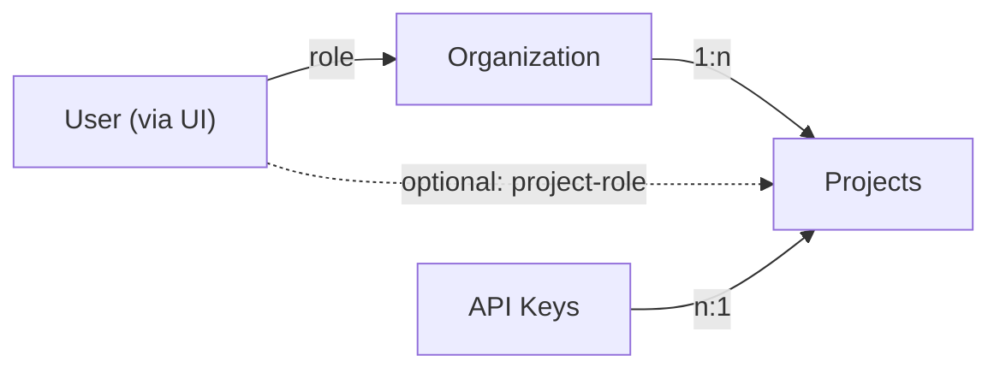

# Langfuse 基于角色的访问控制

RBAC 以 User、Organization、Project 和 Role 为基础：

- **User**：通过[身份认证](/official/administration/authentication-and-sso)登录 Langfuse 的个人。
- **Organization**：包含各个 Project 的顶层实体。
- **Project**：聚合 Langfuse 数据，为权限隔离提供边界。
- **Role**：定义一个用户在组织和项目中的权限。默认分配组织级角色，也可以针对单个项目覆盖。
- **API Key**：用于调用 Langfuse API，关联 Project，**不绑定具体用户**。

## 访问组织与项目

可通过页面顶部导航下拉菜单切换 Organization 与 Project。

[观看切换项目演示](https://static.langfuse.com/docs-videos/project_menu.mp4)。

## 角色与 Scope

- `Owner`：拥有全部权限。
- `Admin`：可以修改项目设置并授予用户访问权限。
- `Member`：可查看指标、创建 Score，但不能配置项目。
- `Viewer`：只能查看项目与组织，多数配置隐藏。
- `None`：无默认组织访问权限，适合只授予特定项目访问权的场景。

### 组织级 Scope 完整列表

| 角色 | Scopes（权限标识与原文一致） |
| --- | --- |
| `OWNER` | `projects:create`、`projects:transfer_org`、`organization:CRUD_apiKeys`、`organization:update`、`organization:delete`、`organizationMembers:CUD`、`organizationMembers:read`、`orgAuditLogs:read`、`langfuseCloudBilling:CRUD` |
| `ADMIN` | `projects:create`、`projects:transfer_org`、`organization:update`、`organizationMembers:CUD`、`organizationMembers:read`、`orgAuditLogs:read` |
| `MEMBER` | `organizationMembers:read` |
| `VIEWER` | 无 |
| `NONE` | 无 |

### 项目级 Scope 完整列表

| 角色 | Scopes（权限标识与原文一致） |
| --- | --- |
| `OWNER` | `project:read`、`project:update`、`project:delete`、`projectMembers:read`、`projectMembers:CUD`、`apiKeys:read`、`apiKeys:CUD`、`integrations:CRUD`、`objects:publish`、`objects:bookmark`、`objects:tag`、`traces:delete`、`scores:CUD`、`scoreConfigs:CUD`、`scoreConfigs:read`、`datasets:read`、`datasets:CUD`、`prompts:CUD`、`prompts:read`、`promptProtectedLabels:CUD`、`models:CUD`、`evaluator:CUD`、`evaluator:read`、`evaluationRule:CUD`、`evaluationRule:read`、`evalJobExecution:read`、`evalDefaultModel:CUD`、`evalDefaultModel:read`、`llmApiKeys:read`、`llmApiKeys:create`、`llmApiKeys:update`、`llmApiKeys:delete`、`llmSchemas:CUD`、`llmSchemas:read`、`llmTools:CUD`、`llmTools:read`、`playground:execute`、`batchExports:create`、`batchExports:read`、`comments:CUD`、`comments:read`、`annotationQueues:read`、`annotationQueues:CUD`、`annotationQueueAssignments:read`、`annotationQueueAssignments:CUD`、`promptExperiments:CUD`、`promptExperiments:read`、`projectAuditLogs:read`、`dashboards:read`、`dashboards:CUD`、`TableViewPresets:CUD`、`TableViewPresets:read`、`automations:CUD`、`automations:read`、`alerts:read`、`alerts:CUD` |
| `ADMIN` | `project:read`、`project:update`、`projectMembers:read`、`projectMembers:CUD`、`apiKeys:read`、`apiKeys:CUD`、`integrations:CRUD`、`objects:publish`、`objects:bookmark`、`objects:tag`、`traces:delete`、`scores:CUD`、`scoreConfigs:CUD`、`scoreConfigs:read`、`datasets:read`、`datasets:CUD`、`prompts:CUD`、`prompts:read`、`promptProtectedLabels:CUD`、`models:CUD`、`evaluator:CUD`、`evaluator:read`、`evaluationRule:CUD`、`evaluationRule:read`、`evalJobExecution:read`、`evalDefaultModel:CUD`、`evalDefaultModel:read`、`llmApiKeys:read`、`llmApiKeys:create`、`llmApiKeys:update`、`llmApiKeys:delete`、`llmSchemas:CUD`、`llmSchemas:read`、`llmTools:CUD`、`llmTools:read`、`playground:execute`、`batchExports:create`、`batchExports:read`、`comments:CUD`、`comments:read`、`annotationQueues:read`、`annotationQueues:CUD`、`annotationQueueAssignments:read`、`annotationQueueAssignments:CUD`、`promptExperiments:CUD`、`promptExperiments:read`、`projectAuditLogs:read`、`dashboards:read`、`dashboards:CUD`、`TableViewPresets:CUD`、`TableViewPresets:read`、`automations:CUD`、`automations:read`、`alerts:read`、`alerts:CUD` |
| `MEMBER` | `project:read`、`projectMembers:read`、`apiKeys:read`、`objects:publish`、`objects:bookmark`、`objects:tag`、`scores:CUD`、`scoreConfigs:CUD`、`scoreConfigs:read`、`datasets:read`、`datasets:CUD`、`prompts:CUD`、`prompts:read`、`evaluator:CUD`、`evaluator:read`、`evaluationRule:read`、`evaluationRule:CUD`、`evalJobExecution:read`、`evalDefaultModel:read`、`evalDefaultModel:CUD`、`llmApiKeys:read`、`llmSchemas:read`、`llmSchemas:CUD`、`llmTools:CUD`、`llmTools:read`、`playground:execute`、`batchExports:create`、`batchExports:read`、`comments:CUD`、`comments:read`、`annotationQueues:read`、`annotationQueues:CUD`、`annotationQueueAssignments:read`、`promptExperiments:CUD`、`promptExperiments:read`、`dashboards:read`、`dashboards:CUD`、`TableViewPresets:CUD`、`TableViewPresets:read`、`automations:read`、`alerts:read`、`alerts:CUD` |
| `VIEWER` | `project:read`、`prompts:read`、`evaluator:read`、`scoreConfigs:read`、`evaluationRule:read`、`evalJobExecution:read`、`evalDefaultModel:read`、`datasets:read`、`llmApiKeys:read`、`llmSchemas:read`、`llmTools:read`、`comments:read`、`annotationQueues:read`、`promptExperiments:read`、`dashboards:read`、`TableViewPresets:read`、`automations:read`、`alerts:read` |
| `NONE` | 无 |

### 如何理解 Scope

权限标识格式为 `resource:action`。`read` 代表查看；`CUD` 代表创建、更新、删除；`CRUD` 包括读取。项目级 `Admin` 拥有项目级 `Owner` 的所有权限，**唯独没有 `project:delete`**。

| 目标操作 | 最低角色 |
| --- | --- |
| 查看 Trace、Dashboard、Prompt、Dataset、Evaluator | 项目 `Viewer` |
| 通过 UI 或 Blob Storage 导出数据 | `Member`（`batchExports:create/read`） |
| 创建 Score、Dataset、Prompt 或 Evaluator | `Member` |
| 创建/删除项目 API Key、LLM Connection、Integration | `Admin` |
| 删除 Trace | 项目 `Admin` |
| 删除整个 Project | 项目 `Owner` |
| 创建组织 API Key、删除组织或管理 Billing | 组织 `Owner` |

用户在 Project 上的**有效角色**优先使用显式的项目级 Role，否则使用组织级 Role。项目级 `None` 表示“不覆盖组织角色”，并非绝对拒绝访问。有效角色缺少 `project:read` 时，整个项目对用户隐藏，因此 `Viewer` 或 `None` 组织成员在没有获得适当项目权限时访问接口可能返回 Forbidden。

## 管理用户

### 向组织添加用户

在 Organization Settings 输入邮箱并授予 Role。用户收到邮件通知，登录后可以访问组织。尚无 Langfuse 账号者，在注册前显示为待接受的邀请。

### 修改用户角色

具有 `organizationMembers:CUD` 的用户可在 Organization Settings 更改组织成员角色，影响该成员在组织内各个项目的默认权限。用户只能分配**不高于自己**的角色。

## 管理 Project

### 创建项目

有 `projects:create` 的用户可以在组织内创建新 Project。

### 转移到其他组织

有 `projects:transfer_org` 权限的用户可以把 Project 从当前组织转入新组织。转移后访问权限由新组织的 Role 决定。

**不会丢失数据**：Project 的设置、数据与配置一起转移，API Key 及除访问管理以外的设置保持不变，Trace 和 Prompt Management 等功能无需中断。

## 项目级角色

**可用性限制：**项目级 Role 覆盖功能并非所有方案都有：官方能力表列出 Hobby、Core 不提供，Pro 需 Team Add-on，Enterprise 和符合条件的自托管 Enterprise 可用。具体订阅及实例许可仍以官方权限页面实时信息为准。

可用性：Hobby、Core 不提供；Pro 需要 Team Add-on；Enterprise 完整支持；自托管需要 Enterprise Edition。

默认情况下，成员继承组织角色；如果为 Project 显式分配 Role，则**覆盖该项目上的组织 Role**。

需要仅允许访问部分项目时，可把用户的组织级 Role 设为 `None`，然后在允许访问的项目上授予对应角色。

## API Key

API Key 认证[公开 API](https://langfuse.com/docs/api-and-data-platform/features/public-api)和 SDK 调用，不绑定用户。

- **Project API Key**：前缀 `pk-lf-...` / `sk-lf-...`，在 **Project Settings → API Keys** 创建。管理需要 `apiKeys:CUD`（项目 Owner 或 Admin）；Member 可以查看列表。
- **Organization API Key**：作用于整个组织，配合 [Organization Management API](/official/administration/scim-and-org-api)使用。管理要求组织 Owner 的 `organization:CRUD_apiKeys`。

::: warning
Secret Key **仅在创建时显示一次**。Langfuse 只存储不可逆的哈希值，支持人员也无法恢复。设置页面只显示 Public Key 以及 `sk-lf-...1234` 形式的末尾遮蔽预览。

丢失密钥应先创建新 Key、切换应用，再删除旧 Key；没有单独的 Rotate 操作。删除后旧 Key **立即失效**。还可设置过期日期，使用 Last used 判断是否能安全清理。
:::

## 相关资源

- [SCIM 与组织 API](/official/administration/scim-and-org-api)
- [如何组织生产、测试与开发环境](https://langfuse.com/faq/all/managing-different-environments)

GitHub Discussions 为动态内容，参阅[原文](https://langfuse.com/docs/administration/rbac)。

---

原文：[Langfuse Access Control](https://langfuse.com/docs/administration/rbac) · 非官方中文翻译；权限标识原样保留。
