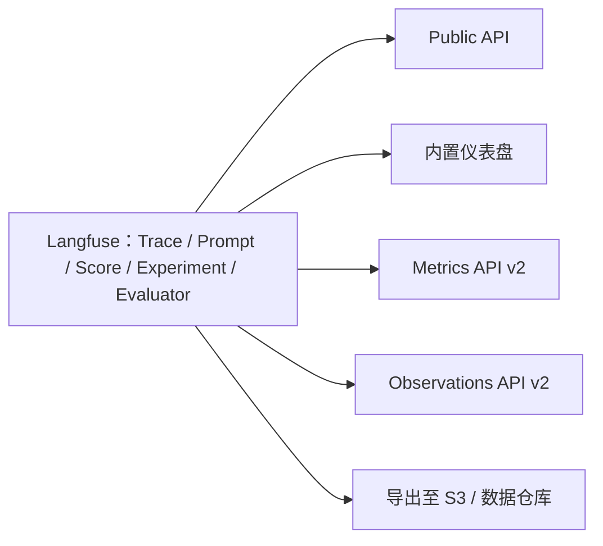

# API 与数据平台

**Langfuse 以开放、可扩展、灵活为设计目标**。用户可以在 Langfuse 的数据平台之上构建自定义工作流，例如：

- 根据 Langfuse 记录的 LLM 成本进行计费。
- 在外部仪表盘展示在线评估结果。
- 导出原始 Trace 数据，用于微调。
- 将数据仓库中的真实用户行为与 LLM 评估结果关联。

## 从这里开始

按需求选择合适的数据访问方式：

| 目标 | 推荐方式 |
| --- | --- |
| 从终端或编程 Agent 使用 Langfuse | [CLI](/official/api-and-data-platform/features/cli) |
| AI 工具不能执行 Shell 命令 | [MCP Server](https://langfuse.com/docs/api-and-data-platform/features/mcp-server) |
| 聚合成本、用量、延迟、请求量和评分 | [Metrics API v2](/official/metrics/features/metrics-api) |
| 获取实验运行记录、测试项与评估评分 | [Experiments API](https://langfuse.com/docs/api-and-data-platform/features/public-api#experiments) |
| 查询 Observation 明细 | [Observations API v2](https://langfuse.com/docs/api-and-data-platform/features/public-api#v2) |
| 从 Python 或 JS/TS 调用 API | [SDK 查询](https://langfuse.com/docs/api-and-data-platform/features/query-via-sdk) |
| 定期导出大规模数据 | [Blob Storage Export](https://langfuse.com/docs/api-and-data-platform/features/export-to-blob-storage) |
| 下载一次性的筛选结果 | [从 UI 导出](/official/api-and-data-platform/features/export-from-ui) |
| 管理提示词、数据集、项目等资源 | [Public API](https://langfuse.com/docs/api-and-data-platform/features/public-api) |
| 根据机器可读规格生成 API 客户端 | [OpenAPI YAML](https://cloud.langfuse.com/generated/api/openapi.yml) |

自托管 Langfuse **v4.36.0 或以上**还可以使用 `/api/openapi.yaml` 获取规格文件，在 `/api/docs` 使用交互式 API 文档。

## 功能入口

- [Langfuse for Agents](https://langfuse.com/agents)
- [CLI](/official/api-and-data-platform/features/cli)
- [MCP Server](https://langfuse.com/docs/api-and-data-platform/features/mcp-server)
- [Public API](https://langfuse.com/docs/api-and-data-platform/features/public-api)
- [通过 SDK 查询](https://langfuse.com/docs/api-and-data-platform/features/query-via-sdk)
- [Observations API](https://langfuse.com/docs/api-and-data-platform/features/public-api#v2)
- [Experiments API](https://langfuse.com/docs/api-and-data-platform/features/public-api#experiments)
- [Metrics API](/official/metrics/features/metrics-api)
- [UI 导出](/official/api-and-data-platform/features/export-from-ui)
- [Blob Storage 导出](https://langfuse.com/docs/api-and-data-platform/features/export-to-blob-storage)
- [PostHog 集成](https://langfuse.com/integrations/analytics/posthog)
- [Mixpanel 集成](https://langfuse.com/integrations/analytics/mixpanel)

---

原文：[API & Data Platform](https://langfuse.com/docs/api-and-data-platform/overview) · 非官方中文翻译。
