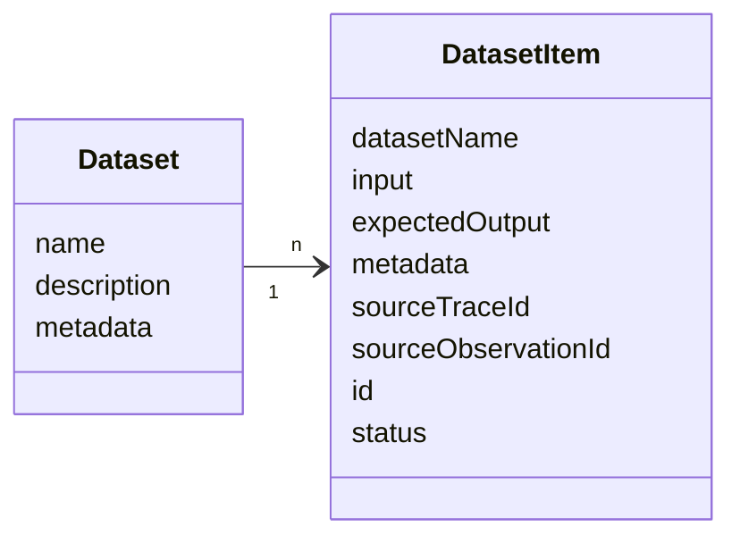
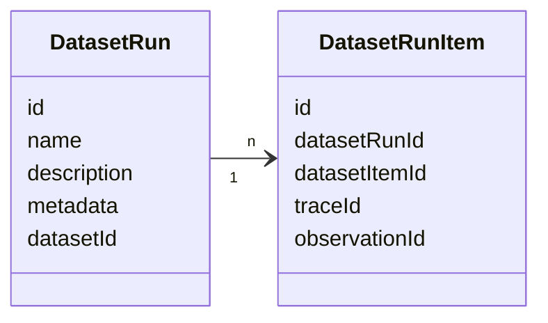
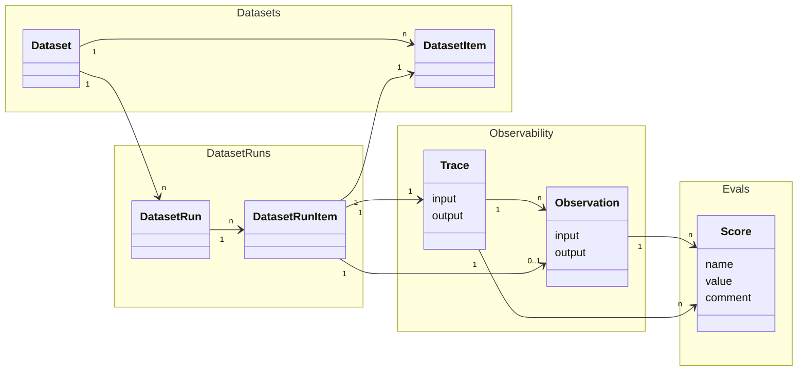

# 实验数据模型

本页介绍 Langfuse 实验相关对象。对象之间的概念关系见[核心概念](https://langfuse.com/docs/evaluation/core-concepts)；Score 和 ScoreConfig 见[评分数据模型](/official/evaluation/scores/data-model)。

详细类型参阅 [Python SDK](https://python.reference.langfuse.com)、[JS/TS SDK](https://js.reference.langfuse.com)与[公共 API](https://api.reference.langfuse.com)。

## 实验的创建方式

| 方式 | 适用情况 |
| --- | --- |
| [SDK 实验](https://langfuse.com/docs/evaluation/experiments/experiments-via-sdk) | Python 或 JS/TS Experiment Runner |
| [UI 实验](/official/evaluation/experiments/experiments-via-ui) | 从 Dataset 页面测试 Prompt 或模型 |
| [OpenTelemetry 实验](/official/evaluation/experiments/experiments-via-opentelemetry) | 其他语言、自定义 OTLP 或重摄入实验 Trace |

已有实验创建后，可以通过 [Experiments API](https://langfuse.com/docs/api-and-data-platform/features/public-api#experiments)读取 Run、Item 和 Score。**没有公开的 REST API 用于创建新的 Experiment Run**；旧 `POST /api/public/dataset-run-items` 已弃用。

## 对象

### Dataset 与 DatasetItem

Dataset 是一组输入，以及可选的期望输出，由多个 `DatasetItem` 组成。

#### Dataset 对象

| 字段 | 类型 | 必填 | 说明 |
| --- | --- | --- | --- |
| `id` | string | 是 | 数据集唯一 ID |
| `name` | string | 是 | 数据集名称 |
| `description` | string | 否 | 描述 |
| `metadata` | object | 否 | 附加元数据 |
| `remoteExperimentUrl` | string | 否 | 触发实验的 Webhook 地址 |
| `remoteExperimentPayload` | object | 否 | 触发实验时发送的 Payload |

#### DatasetItem 对象

| 字段 | 类型 | 必填 | 说明 |
| --- | --- | --- | --- |
| `id` | string | 是 | 唯一 ID；按此 ID Upsert，项目内唯一，不能跨 Dataset 复用 |
| `datasetId` | string | 是 | 所属 Dataset 的 ID |
| `input` | object | 否 | 输入数据 |
| `expectedOutput` | object | 否 | 期望输出 |
| `metadata` | object | 否 | 附加元数据 |
| `mediaReferences` | object[] | 否 | 输入、期望输出或元数据中已解析的媒体引用；在 SDK 或 API 返回已解析媒体时包含 |
| `sourceTraceId` | string | 否 | 关联源 Trace 的 ID |
| `sourceObservationId` | string | 否 | 关联源 Observation 的 ID |
| `status` | DatasetStatus | 否 | 默认 `ACTIVE`，还可以设为 `ARCHIVED` |

#### DatasetItemMediaReference 对象

这个对象将 DatasetItem 的 `input`、`expectedOutput` 或 `metadata` 中保存的媒体引用 Token 映射到带签名的下载 URL。

| 字段 | 类型 | 必填 | 说明 |
| --- | --- | --- | --- |
| `field` | string | 是 | 媒体所在字段：`input`、`expected_output`（对应 expectedOutput）或 `metadata` |
| `referenceString` | string | 是 | Item 中保存的原始 Langfuse 媒体引用字符串 |
| `jsonPath` | string | 是 | 对应字段内部的 JSONPath，如 `$['image']` |
| `media` | object | 是，可为 null | 解析出的媒体元数据；媒体不存在或上传失败时为 null |

`media` 对象包含 `mediaId`、`contentType`、`contentLength`、`url` 和 `urlExpiry`。URL 是有过期时间的签名下载链接，应在过期前使用；需要刷新时，重新获取 Dataset。

### DatasetRun（Experiment Run）

DatasetRun 将一个 Dataset 送入 LLM 应用执行，可以选择对结果评分，因此也叫 Experiment Run。

#### DatasetRun 对象

| 字段 | 类型 | 必填 | 说明 |
| --- | --- | --- | --- |
| `id` | string | 是 | 运行唯一 ID |
| `name` | string | 是 | 运行名称 |
| `description` | string | 否 | 运行描述 |
| `metadata` | object | 否 | 运行附加元数据 |
| `datasetId` | string | 是 | 所属 Dataset 的 ID |

实验的 Metadata 与 Description 描述**整个 Run**，而非某个 Item。Python 和 JS/TS Runner 会将实验 Metadata 传播到子 Observation，但 Description 仅写入实验 Item 的根 Observation，不传播给子节点。应保证携带这些字段的 Observation 数据一致。直接摄入时参阅 [OTEL 实验属性说明](https://langfuse.com/integrations/native/opentelemetry/experiments)。

#### DatasetRunItem 对象

| 字段 | 类型 | 必填 | 说明 |
| --- | --- | --- | --- |
| `id` | string | 是 | 运行项 ID |
| `datasetRunId` | string | 是 | 所属运行 ID |
| `datasetItemId` | string | 是 | 所关联的 DatasetItem ID |
| `traceId` | string | 是 | 关联 Trace ID |
| `observationId` | string | 否 | 关联 Observation ID |

Langfuse 当前假定一个实验中每个 DatasetItem **只出现一次**，读取时每个 DatasetItem 至多得到一个 Experiment Item。重复运行项支持情况见 [Issue #5855](https://github.com/langfuse/langfuse/issues/5855)。

::: info
通常建议 DatasetRunItem **直接引用 Trace ID**；Observation ID 关联仅为兼容旧版 SDK 而保留。
:::

### 对象端到端关系

- DatasetRun 使用 LLM 应用遍历整个 Dataset 或选定 DatasetItem。
- 每个 DatasetItem 作为输入执行时，产生一个 DatasetRunItem 和一条 Trace。
- 可以选择给 Trace 增加 Score，以评估实验运行期间 LLM 的输出。

详见[评估核心概念](https://langfuse.com/docs/evaluation/core-concepts)、[追踪数据模型](/official/observability/data-model)与 [Score 数据模型](/official/evaluation/scores/data-model)。

## 函数定义

通过 SDK 运行实验时，需要定义 **Task** 与 **Evaluator** 函数；Runner 会对每个 DatasetItem 调用这些用户函数。

### Task

Task 接收一个 DatasetItem，在运行时返回 Output。

- [Python `TaskFunction`](https://python.reference.langfuse.com/langfuse/experiment#TaskFunction)
- [JS/TS `ExperimentTask`](https://js.reference.langfuse.com/types/_langfuse_client.ExperimentTask.html)

### Evaluator

Evaluator 对单个 DatasetItem 的 Task 输出评分；接收 Input、Output、Expected Output 和 Metadata，返回 `Evaluation` 对象，并以 Score 保存在 Langfuse。

- [Python `EvaluatorFunction`](https://python.reference.langfuse.com/langfuse/experiment#EvaluatorFunction)
- [JS/TS `Evaluator`](https://js.reference.langfuse.com/types/_langfuse_client.Evaluator.html)

### Run Evaluator

Run Evaluator 对**整个实验**的结果评分并计算聚合指标。针对 Langfuse Dataset 执行时，生成的 Score 关联 DatasetRun。

- [Python `RunEvaluatorFunction`](https://python.reference.langfuse.com/langfuse/experiment#RunEvaluatorFunction)
- [JS/TS `RunEvaluator`](https://js.reference.langfuse.com/types/_langfuse_client.RunEvaluator.html)

完整使用示例参阅 [SDK 实验](https://langfuse.com/docs/evaluation/experiments/experiments-via-sdk)；不通过 SDK 摄入实验 Trace 参阅 [OpenTelemetry 实验](/official/evaluation/experiments/experiments-via-opentelemetry)。

## 本地数据集

使用 Langfuse v4 及当前 SDK 时，[本地数据实验](https://langfuse.com/docs/evaluation/experiments/experiments-via-sdk)无需托管 Dataset，也会显示在 **Experiments** 下。每次 Task 执行还会创建 Trace 供排障。详见[比较实验](/official/evaluation/experiments/compare-experiments)。

---

原文：[Experiments Data Model](https://langfuse.com/docs/evaluation/experiments/data-model) · 非官方中文翻译。
