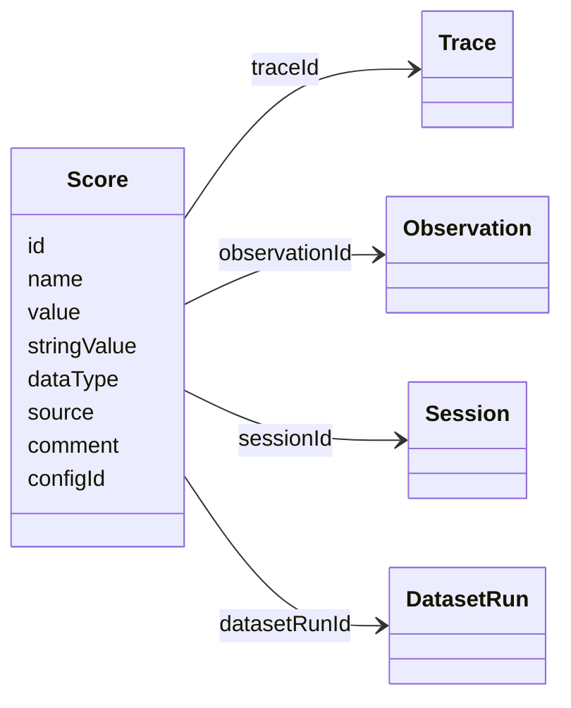
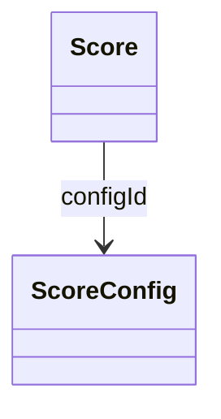

# Score 数据模型

本页解释 Langfuse 中与评分有关的数据模型。用途介绍参阅[Score 概览](https://langfuse.com/docs/evaluation/scores/overview)，实验运行与函数定义参阅[实验数据模型](https://langfuse.com/docs/evaluation/experiments/data-model)。

详细 API 见 [Python SDK](https://python.reference.langfuse.com)、[JS/TS SDK](https://js.reference.langfuse.com)、[公共 API](https://api.reference.langfuse.com)。

## Score

Score 用于保存评估结果，可以为 Trace、Observation、Session 或 Dataset Run 评分。数据可以来自人工标注、SDK/API 或自动 LLM-as-a-Judge 评估器。

- 每个 Score **恰好关联** Trace、Observation、Session 或 DatasetRun 中的一个；
- 类型为数值、类别、布尔或文本；
- 可以选择绑定 `ScoreConfig`，强制符合统一的数据 Schema。

### Score 对象字段

| 字段 | 类型 | 必填 | 说明 |
| --- | --- | --- | --- |
| `id` | string | 是 | 唯一 ID，SDK 自动生成，也可用作更新评分时的幂等键 |
| `name` | string | 是 | 名称，例如 `user_feedback`、`hallucination_eval` |
| `value` | number | 否 | 数值及布尔类型必有；类别类型可选，文本类型不用 |
| `stringValue` | string | 否 | 类别、布尔对应字符串和文本类型值；有配置时按配置自动设置类别值 |
| `dataType` | string | 否 | 有 `configId` 时从配置自动确定，否则手动设为 `NUMERIC`、`CATEGORICAL`、`BOOLEAN`、`TEXT` |
| `source` | string | 是 | 来源自动设置为 `API`、`EVAL` 或 `ANNOTATION` |
| `comment` | string | 否 | 用户反馈、评估推理说明或内部备注 |
| `traceId` | string | 否 | 关联的 Trace ID |
| `observationId` | string | 否 | 关联的 Observation ID |
| `sessionId` | string | 否 | 关联的 Session ID |
| `datasetRunId` | string | 否 | 关联的 Dataset Run ID |
| `configId` | string | 否 | 强制评分符合指定 Schema 的配置 ID，可在 UI 或 API 中创建 |

### 常见关联层级

| 层级 | 用途 |
| --- | --- |
| Trace | 评估一次完整交互，最常见 |
| Observation | 评估 Trace 中的单个步骤 |
| Session | 对跨多次交互的输出进行综合评估 |
| Dataset Run | 记录一次数据集运行的整体表现 |

## ScoreConfig

ScoreConfig 用于为评分指定统一 Schema，使团队评价结果保持一致、可比较。可以通过 UI 或 API 创建。配置**不可变**，但可以归档，也可以之后恢复。

ScoreConfig 包含评分名称、数据类型以及数值范围等约束。数据类型可为 `NUMERIC`、`CATEGORICAL`、`BOOLEAN`、`TEXT`；数值评分设置最小与最大值，类别评分设置自定义类别，文本限制 **1–500 字符**。

### ScoreConfig 对象字段

| 字段 | 类型 | 必填 | 说明 |
| --- | --- | --- | --- |
| `id` | string | 是 | 评分配置唯一标识 |
| `name` | string | 是 | 配置名称，例如 `user_feedback` |
| `dataType` | string | 是 | `NUMERIC`、`CATEGORICAL`、`BOOLEAN` 或 `TEXT` |
| `isArchived` | boolean | 否 | 是否归档，默认 `false` |
| `minValue` | number | 否 | 数值评分下界，未指定默认为负无穷 |
| `maxValue` | number | 否 | 数值评分上界，未指定默认为正无穷 |
| `categories` | list | 否 | 类别定义，包含标签与值的对象数组 |
| `description` | string | 否 | 配置详细说明 |

---

原文：[Scores Data Model](https://langfuse.com/docs/evaluation/scores/data-model) · 非官方中文翻译。
