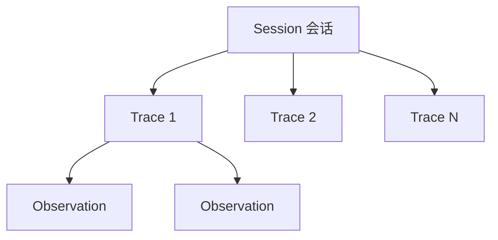
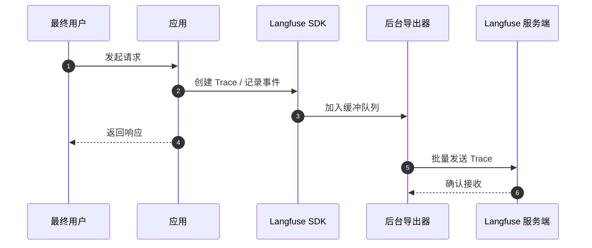
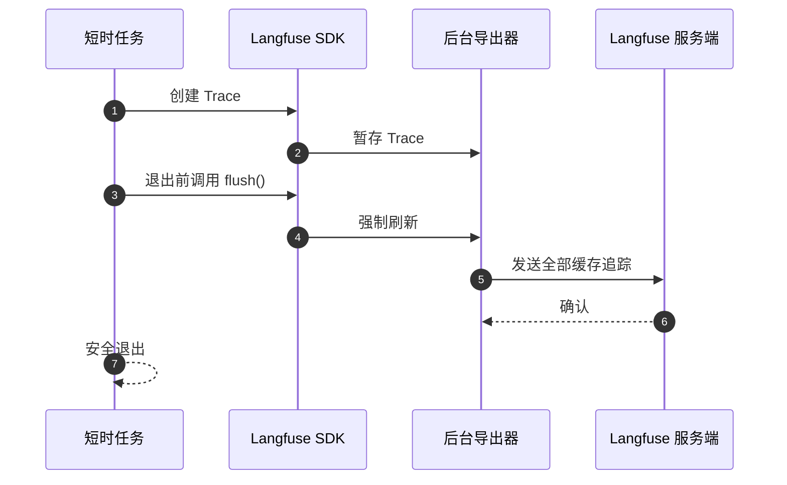

# 核心概念

本页介绍 Langfuse 如何组织和采集应用数据。理解数据模型后，你会更容易排查问题和分析追踪记录。

准备开始实践？参阅[追踪快速开始](/official/observability/get-started)，生成第一条 Trace。

## Observation、Trace 与 Session

Langfuse 将应用数据组织为三个核心概念：**Observation（观测步骤）**、**Trace（追踪）**和**Session（会话）**。

### Observation 与 Trace

`Observation` 表示应用执行的单个步骤，比如 LLM 调用、工具调用、检索操作等。Observation 可以嵌套以体现应用结构。Langfuse 支持多种面向 LLM 的[观测类型](/official/observability/features/observation-types)，例如 Generation 和 Event。（Langfuse 将 Span 统称为 Observation，同时 Span 也是一种特定的 Observation 类型。）

`Trace` 代表一次请求或操作。例如：用户提出一个问题、聊天机器人处理并给出最终回答的整个过程。具有相同 `trace_id` 的 Observation 会被逻辑上归入同一个 Trace。

Trace 级别的属性（例如 `user_id`、`session_id`、`tags`、`metadata`）会存在于该追踪下的每个 Observation 上，并由 SDK 自动传播。

在概念上，Langfuse 将 Observation 存储于同一张表：每一行同时包含 Observation 自身的数据以及对应的 Trace 级别属性副本。这样有助于提高查询和聚合效率。

关于 Observation 表的日常查询、筛选与保存视图，参阅[官方说明](https://langfuse.com/faq/all/explore-observations-in-v4)。

### Session

你可以选择将多个 Trace 组成一个 [Session（会话）](/official/observability/features/sessions)，把同一次用户交互中的追踪关联在一起。典型示例是聊天应用中的一个对话线程。

对于多轮对话或多步骤工作流，建议使用 Session。添加方法见 [Session 文档](/official/observability/features/sessions)。

## 添加属性

建立 Trace 和 Observation 结构后，可以通过附加属性增强数据。这些属性相当于标签，便于按使用场景筛选、分组和分析追踪记录。

| 属性 | 用途 |
| --- | --- |
| [Environment（环境）](/official/observability/features/environments) | 区分 `production`、`staging`、`development` 等部署环境 |
| [Tag（标签）](/official/observability/features/tags) | 按功能、API 端点或工作流对追踪分类 |
| [User（用户）](/official/observability/features/users) | 记录触发 Trace 的最终用户 |
| [Metadata（元数据）](/official/observability/features/metadata) | 以灵活的键值对存储自定义信息 |
| [Release & Version（发布与版本）](/official/observability/features/releases-and-versioning) | 跟踪应用版本与组件变更 |

## Langfuse 如何采集数据

### 基于 OpenTelemetry

Langfuse 基于 [OpenTelemetry](https://opentelemetry.io/) 构建。OpenTelemetry 是采集应用遥测数据的开放标准。

这意味着你不必局限于 Langfuse 专有 SDK。可以将追踪同时发送到多个目的地，例如使用 Langfuse 分析 LLM 行为，使用 Datadog 监控基础设施。

集成方法详见 [OpenTelemetry 集成指南](https://langfuse.com/integrations/native/opentelemetry)。

#### 埋点（Instrumentation）

埋点是在应用中加入记录执行过程的代码。启用后，Langfuse 通过 OpenTelemetry 捕获相关事件，并组织为 Trace 与 Observation。

[快速开始指南](/official/observability/get-started)介绍了如何为函数添加追踪。

### 后台处理

Langfuse 不会在每条追踪产生时都同步发送数据，因为这会拖慢应用。相反，它会先在本地缓冲，随后在后台批量导出，使请求处理保持流畅。

#### 长时间运行的应用

对于 Web 服务和 API 服务等常驻进程，后台导出器会持续运行，有时间按周期或批量阈值刷新队列。因此，上述后台导出机制通常能正常工作。

#### 短生命周期的应用

脚本、一次性任务等程序执行完后很快退出，可能在缓冲队列发送之前结束进程，导致追踪数据丢失。

因此，**短生命周期应用必须在退出前显式调用 [`flush()`](/official/observability/features/queuing-batching)**，强制导出器发送所有缓冲追踪。

---

原文：[Langfuse Observability Core Concepts](https://langfuse.com/docs/observability/data-model) · 非官方中文翻译；保留术语及调用语义。
