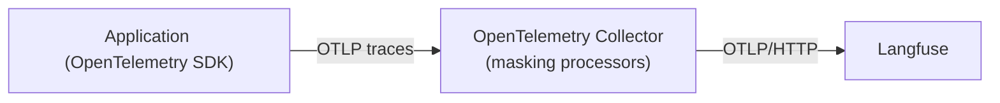

# 对敏感 LLM 数据进行脱敏

Masking 用于控制应用发送到 Langfuse 的[追踪](/official/observability/overview)数据，在离开应用前删除或转换敏感信息：

1. 对 Trace/Observation 输入、输出和 Metadata 中的敏感内容脱敏。
2. 在 OpenTelemetry Span 导出之前修改属性。
3. 根据隐私与合规需求执行细粒度的数据筛选。

更多关于存储数据的安全与隐私措施，参阅[官方安全与合规概览](https://langfuse.com/security)。

## 精校提示：Python Masking 两种 Hook 的行为差异

| Hook | 官方推荐状态 | 作用时间 | 覆盖范围 |
| --- | --- | --- | --- |
| `mask_otel_spans` | **新项目推荐** | Langfuse 决定导出哪些 OpenTelemetry Span 且完成媒体处理后，在导出阶段同步执行 | 经过当前 Langfuse Processor 导出的 Langfuse 和第三方 Instrumentation Span 的原始 OTEL 属性 |
| `mask` | 旧版兼容方式 | Langfuse SDK API 创建或更新属性时同步执行 | 仅 SDK API 传入的数据，不涵盖第三方 Instrumentation 的最终原始 Span |

`mask_otel_spans` 接收批次 Span 的只读快照，返回需要修改的稀疏 Patch。它**只影响当前 Langfuse SDK 的导出副本**，其他 OTEL Exporter（如 Datadog）收到的数据不会因此自动脱敏，必须单独配置。

其失败行为需要特别注意：Hook 抛异常或返回无效 `MaskOtelSpansResult` 时，整个导出批次会被丢弃；单个 `OtelSpanPatch` 无效时，只丢弃对应 Span；无效的属性值可能导致该属性被删除。通常 Hook 在批处理线程执行，但 Flush 和 Shutdown 时也可能在调用线程执行，因此务必保持轻量且可预测。

## 配置 Masking

### Python SDK

Python SDK 提供两种 Hook。**新项目推荐 `mask_otel_spans`**。

| 方法 | 状态 | 执行时机 | 覆盖范围 |
| --- | --- | --- | --- |
| `mask_otel_spans` | 推荐 | Langfuse 决定导出哪些 OTEL Span、完成媒体处理后，在导出阶段执行 | Langfuse SDK 与第三方 Instrumentation 经当前客户端导出的原始 Span Attribute |
| `mask` | 旧版 | Langfuse SDK 创建属性时同步执行 | 通过 `start_observation()`、`update()`、`set_trace_io()` 等 SDK API 设置的数据 |

`mask_otel_spans` 接收一次 OpenTelemetry 导出批次的**只读快照**，返回需要改变的 Span 的稀疏 Patch：


```python
from typing import Optional

from langfuse import Langfuse
from langfuse.types import (
    MaskOtelSpansParams,
    MaskOtelSpansResult,
    OtelSpanPatch,
)


def mask_otel_spans(
    *, params: MaskOtelSpansParams
) -> Optional[MaskOtelSpansResult]:
    patches = {}

    for identifier, span in params.spans.items():
        if span.instrumentation_scope_name == "openai":
            patches[identifier] = OtelSpanPatch(
                delete_attributes=(
                    "gen_ai.prompt.0.content",
                    "gen_ai.completion.0.content",
                ),
                set_attributes={"masking.applied": True},
            )

    return MaskOtelSpansResult(span_patches=patches)


langfuse = Langfuse(mask_otel_spans=mask_otel_spans)
```


#### `mask_otel_spans` 具体行为

- `params.spans` 是一个导出批次，**不保证**包含完整 Trace、请求或 Observation 树。
- 键为 `OtelSpanIdentifier(trace_id, span_id)`。返回 Patch 时应重用提供的 Identifier。
- 值为 `OtelSpanData`，已经经过 `should_export_span` 筛选与导出阶段媒体处理；`attributes`、`resource_attributes` 是只读的。
- 返回 `None` 表示整批保持原样；返回 `MaskOtelSpansResult(span_patches=...)` 表示删除或替换某些 Span 属性。
- Patch 是稀疏的，不需要更改的 Span 不必包含。
- `OtelSpanPatch` **先执行 `delete_attributes`，后执行 `set_attributes`**，同键时设置操作最终生效。
- 设置的值必须符合 OTEL 属性类型：字符串、布尔、整数、浮点数或这些基础类型的同质序列。
- Hook 只能修改 Span 属性，不能修改 Span 名称、ID、父关系、Resource Attribute、Event、Link 或 Instrumentation Scope。
- 只影响**本 Langfuse 客户端导出的 Span**，不会影响其他 Exporter。

::: info
如果应用还通过独立的 OTEL Processor 或 Exporter 将相同 Span 发送到其他可观测性平台，该平台收到的仍是**未经此 Hook 修改的副本**。需要在每个非 Langfuse 导出链路中单独脱敏。
:::

::: warning
`mask_otel_spans` 是**同步** Hook，通常在 OTEL Batch Processor 的 Worker 线程执行；但 `flush()` 或 Shutdown 时也可能运行于调用者线程。应保持其确定性和快速执行，避免长期运行、无限重试、请求局部状态、依赖当前活动 Span 或异步 I/O。耗时操作会阻塞队列并延迟导出。

Hook 抛异常或返回无效 `MaskOtelSpansResult` 时，会丢弃**整个导出批次**。单个 `OtelSpanPatch` 无效则只丢弃该 Span；单个属性值无效则只删除对应属性。
:::

#### 旧版 `mask` Hook

`mask` 在 SDK 属性创建时同步执行，只影响 SDK 显式设置的数据，不会读取第三方 Instrumentation 最终的原始 OTEL Span。

仅在确实需要**创建 SDK 属性时**转换数据的情况下使用：


```python
from typing import Any

from langfuse import Langfuse


def masking_function(*, data: Any, **kwargs: Any) -> Any:
    if isinstance(data, str) and data.startswith("SECRET_"):
        return "REDACTED"

    if isinstance(data, dict):
        return {key: masking_function(data=value) for key, value in data.items()}

    if isinstance(data, list):
        return [masking_function(data=item) for item in data]

    return data


langfuse = Langfuse(mask=masking_function)
```


### Python 示例：脱敏信用卡号码

此示例扫描导出的 OpenTelemetry **字符串属性**，检测类似信用卡号的内容，并在导出到 Langfuse 前替换：


```python
import re
from typing import Optional

from langfuse import Langfuse, observe
from langfuse.types import (
    MaskOtelSpansParams,
    MaskOtelSpansResult,
    OtelSpanPatch,
)

credit_card_pattern = re.compile(r"\b(?:\d[ -]*?){13,19}\b")


def mask_otel_spans(
    *, params: MaskOtelSpansParams
) -> Optional[MaskOtelSpansResult]:
    patches = {}

    for identifier, span in params.spans.items():
        replacements = {}

        for key, value in span.attributes.items():
            if isinstance(value, str):
                masked_value = credit_card_pattern.sub(
                    "[REDACTED CREDIT CARD]", value
                )

                if masked_value != value:
                    replacements[key] = masked_value

        if replacements:
            patches[identifier] = OtelSpanPatch(set_attributes=replacements)

    return MaskOtelSpansResult(span_patches=patches)


langfuse = Langfuse(mask_otel_spans=mask_otel_spans)


@observe()
def process_payment():
    return "Customer paid with card number 4111 1111 1111 1111."


result = process_payment()

print(result)
# Output: Customer paid with card number 4111 1111 1111 1111.

# Flush spans in short-lived applications.
langfuse.flush()
```


应用代码打印的函数返回值**不变**，只是发送到 Langfuse 的 Span 属性已经被脱敏。短生命周期的脚本可以调用 `langfuse.flush()` 保证尽量将 Span 导出。

### Python 示例：脱敏电子邮箱和电话号码


```python
import re
from typing import Optional

from langfuse import Langfuse
from langfuse.types import (
    MaskOtelSpansParams,
    MaskOtelSpansResult,
    OtelSpanPatch,
)

email_pattern = re.compile(r"\b[\w.-]+?@[\w.-]+?\.\w+?\b")
phone_pattern = re.compile(r"\b\d{3}[-. ]?\d{3}[-. ]?\d{4}\b")


def mask_otel_spans(
    *, params: MaskOtelSpansParams
) -> Optional[MaskOtelSpansResult]:
    patches = {}

    for identifier, span in params.spans.items():
        replacements = {}

        for key, value in span.attributes.items():
            if isinstance(value, str):
                masked_value = email_pattern.sub("[REDACTED EMAIL]", value)
                masked_value = phone_pattern.sub("[REDACTED PHONE]", masked_value)

                if masked_value != value:
                    replacements[key] = masked_value

        if replacements:
            patches[identifier] = OtelSpanPatch(set_attributes=replacements)

    return MaskOtelSpansResult(span_patches=patches)


langfuse = Langfuse(mask_otel_spans=mask_otel_spans)
```


### JavaScript / TypeScript SDK

可以在 SDK 初始化时提供 Mask Hook，在 OTEL 导出前修改需要脱敏的 Langfuse Span 数据：


```typescript
import { NodeSDK } from "@opentelemetry/sdk-node";
import { LangfuseSpanProcessor } from "@langfuse/otel";

const spanProcessor = new LangfuseSpanProcessor({
  mask: ({ data }) => {
    const maskedData = data.replace(
      /\b\d{4}[- ]?\d{4}[- ]?\d{4}[- ]?\d{4}\b/g,
      "***MASKED_CREDIT_CARD***",
    );

    return maskedData;
  },
});

const sdk = new NodeSDK({
  spanProcessors: [spanProcessor],
});

sdk.start();
```


### LangChain（JavaScript / TypeScript）

对于 LangChain，应在 Langfuse OTEL Span Processor/相关集成中应用对应的掩码配置，保证向 Langfuse 输出的内容经过脱敏：


```typescript
import { NodeSDK } from "@opentelemetry/sdk-node";
import { LangfuseSpanProcessor } from "@langfuse/otel";
import { CallbackHandler } from "@langfuse/langchain";

const spanProcessor = new LangfuseSpanProcessor({
  mask: ({ data }) => {
    if (typeof data === "string" && data.startsWith("SECRET_")) {
      return "REDACTED";
    }

    return data;
  },
});

const sdk = new NodeSDK({ spanProcessors: [spanProcessor] });
sdk.start();

const handler = new CallbackHandler();
```


## 仅使用 OpenTelemetry 的 Masking

如果不通过 Langfuse SDK，而直接使用 OpenTelemetry：

- **在应用中处理**：尽可能不要记录敏感属性；否则在语言专用或自定义 Span Processor/Exporter 中脱敏。
- **在 OTEL Collector 中处理**：通过 Collector 的 Attribute、Transform 等 Processor 在数据发送到 Langfuse 之前修改或删除属性。

需要注意，在发送敏感数据前应完成脱敏。若使用多个 Exporter，各个导出方向都必须满足自己的隐私策略。





## 相关资源

- [数据保留策略](/official/administration/data-retention)：按配置天数自动删除 Trace、Observation、Score 和媒体。
- [数据删除](/official/administration/data-deletion)：手动删除单条或批量 Trace。

官方动态 GitHub Discussions 未迁移。

---

原文：[Masking](https://langfuse.com/docs/observability/features/masking) · 非官方中文翻译；保留官方全部 7 个代码/图示示例。
