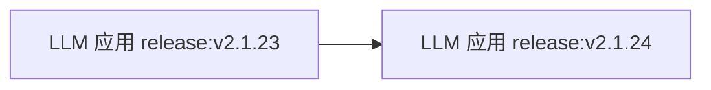
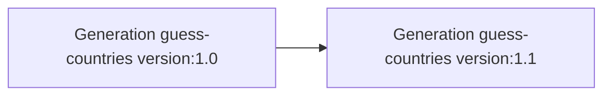

# 发布版本与组件版本

Langfuse 可以跟踪 LLM 应用变更对成本、延迟和质量指标的影响，从而：

- **在生产环境执行 A/B 测试**，例如“切换模型后成本、延迟与质量如何变化？”
- **解释指标的变化**，例如“为什么这条 Chain 的延迟上升？”

## Release 与 Version 的区别

`release` 追踪整个应用的发布版本，通常使用语义版本号或 Git commit hash。

`version` 可添加到任意 Observation 类型（如 span、generation、event 等），用来比较同名组件不同版本的指标表现。

| | Release | Version |
| --- | --- | --- |
| 作用范围 | 整个应用 | 具有指定 `name` 的某类 Observation |
| 常见值 | 语义版本号或 Git SHA | 组件版本，如 `1.0` |
| 使用时机 | 部署了新应用构建 | 修改了特定 Prompt、Chain 或 Generation |





## 在 Langfuse 中查看

Release 和 Version 都出现在 Trace 与 Observation 中。可以按它们筛选部署或组件变更，比较成本、延迟、质量等指标，解释部署前后的变化。


## 设置 Release

SDK 按以下优先级寻找 Release：

1. SDK 初始化传入的值；
2. 环境变量；
3. 常见托管平台自动识别的部署标识。

### Python

```python
from langfuse import Langfuse
langfuse = Langfuse(release="v2.1.24")
```

### JavaScript / TypeScript 和环境变量

SDK 从 `LANGFUSE_RELEASE` 读取，可在 CI/CD 中配置：

```bash
export LANGFUSE_RELEASE="<release_tag>"
```

未显式配置时，SDK 会识别 Vercel、Heroku、Netlify 等平台的环境变量。完整列表见 [JS/TS](https://github.com/langfuse/langfuse-js/blob/v3-stable/langfuse-core/src/release-env.ts) 与 [Python](https://github.com/langfuse/langfuse-python/blob/main/langfuse/_utils/environment.py)。

## 设置 Version

### Python：在上下文中传播

```python
from langfuse import observe, propagate_attributes

@observe()
def process_data():
    with propagate_attributes(version="1.0"):
        result = perform_processing()
        return result
```

手动 Observation：

```python
from langfuse import get_client, propagate_attributes
langfuse = get_client()
with langfuse.start_as_current_observation(as_type="span", name="process-data") as span:
    with propagate_attributes(version="1.0"):
        with span.start_as_current_observation(
            as_type="generation", name="guess-countries", model="gpt-4o"
        ) as generation:
            pass
```

只设置特定 Observation：

```python
from langfuse import get_client
langfuse = get_client()
with langfuse.start_as_current_observation(
    as_type="span", name="process-data", version="1.0"
) as span:
    pass
```

### TypeScript：传播 Version

```typescript
import { startActiveObservation, startObservation, propagateAttributes } from "@langfuse/tracing";
await startActiveObservation("process-data", async () => {
  await propagateAttributes({ version: "1.0" }, async () => {
    const generation = startObservation(
      "guess-countries", { model: "gpt-4" }, { asType: "generation" }
    );
    generation.end();
  });
});
```

单个 Observation：

```typescript
import { startObservation } from "@langfuse/tracing";
const generation = startObservation(
  "guess-countries", { model: "gpt-4" }, { asType: "generation" }
);
generation.update({ version: "1.0" });
generation.end();
```

### LangChain Python

```python
from langfuse import propagate_attributes
from langfuse.langchain import CallbackHandler
handler = CallbackHandler()
with propagate_attributes(version="1.0"):
    chain.invoke({"input": "<user_input>"}, config={"callbacks": [handler]})
```

### LangChain TypeScript

```typescript
import { CallbackHandler } from "@langfuse/langchain";
const handler = new CallbackHandler({ version: "1.0" });
```

## Version 属性的传播约束

官方 `PropagationRestrictionsCallout` 规定：传播的 `version` **必须是字符串，长度不超过 200 个字符**；无效值会被丢弃并给出警告。应在 Trace 执行流程**尽早**调用 `propagate_attributes(version=...)` 或 `propagateAttributes({ version: ... }, callback)`，确保所有需要比较版本的 Observation 都能继承该值。调用前已经创建的 Observation 不会自动回填，因此会影响按版本聚合的质量、延迟与成本指标。

参阅[SDK 添加属性](/official/observability/sdk/instrumentation#添加属性)及[官方原文](https://langfuse.com/docs/observability/features/releases-and-versioning)。

## 相关资源

- [生产提示词 A/B 测试](/official/prompt-management/features/a-b-testing)
- [数据集](https://langfuse.com/docs/evaluation/experiments/datasets)和 [UI 实验](https://langfuse.com/docs/evaluation/experiments/experiments-via-ui)
- [Metrics](/official/metrics/overview)与[自定义 Dashboard](https://langfuse.com/docs/metrics/features/custom-dashboards)

---

原文：[Releases & Versioning](https://langfuse.com/docs/observability/features/releases-and-versioning) · 非官方中文翻译。
