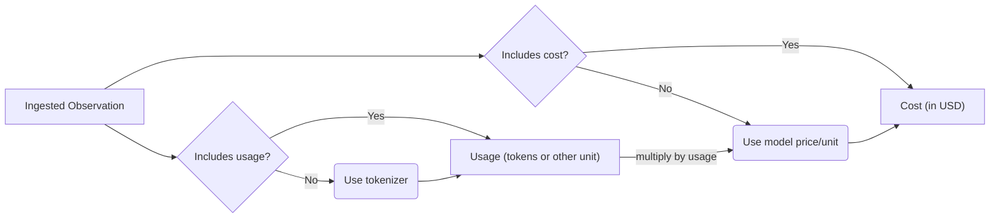

# 模型用量与成本追踪

Langfuse 对 Generation 记录模型名称、Token 使用量与 Cost，支持分析每个用户、模型、Agent 步骤或业务功能的费用。

## 成本数据的用途

可以在 Trace 中查看单次模型调用的成本，汇总模型用量并按用户、版本或环境拆解，同时使用自定义 Dashboard 和 Metrics API 分析趋势。

## 计算原理

**用量与价格计算流程：官方示例**




SDK 集成通常自动读取 Provider 返回的 Usage；Langfuse 根据 Generation 的 `model` 字段匹配 Model Definition（含各计费类别的单位价格），用已知的用量推算 Cost。无法匹配模型时，可手动提供 Usage/Cost 或添加自定义价格配置。

**摄入值优先于推断值**：如果某一计费类别的 Usage / Cost 已通过 SDK 或 API 上报，应优先保留真实上报值，而不是重新以 Tokenizer 或价格表覆盖。此机制也适用于 `embedding` 类型的 Observation；不同 Provider 的 `cached_tokens`、`audio_tokens` 等细分类别应与其计价单位对应。

## 模型定义与价格

**模型与 Tokenizer 定义：官方示例**

```bash
GET    /api/public/models
POST   /api/public/models
GET    /api/public/models/{id}
DELETE /api/public/models/{id}
```

```json
{
  "tokenizerModel": "gpt-3.5-turbo", // tiktoken model name
  "tokensPerName": -1, // OpenAI Chatmessage tokenization config
  "tokensPerMessage": 4 // OpenAI Chatmessage tokenization config
}
```


### Usage

输入 Token、输出 Token、缓存读取/写入 Token、推理 Token 等可能分别计费，应保留模型和 Provider 返回的原始语义。

### Cost

可以使用平台内置的模型价格表，也可为自有模型和合同价格添加自定义 Model Definition；自定义价格应以实际合同和计量单位为准。

### Pricing Tier

不同上下文长度、缓存与批量服务可能适用不同价格层级。配置分层价格后，应按请求属性及匹配优先级选择正确规则。

## 手动摄入 Usage 和 Cost

**手动报告用量和成本：官方示例**

```python
from langfuse import get_client
import anthropic

langfuse = get_client()
anthropic_client = anthropic.Anthropic()

with langfuse.start_as_current_observation(
    as_type="generation",
    name="anthropic-completion",
    model="claude-3-opus-20240229",
    input=[{"role": "user", "content": "Hello, Claude"}]
) as generation:
    response = anthropic_client.messages.create(
        model="claude-3-opus-20240229",
        max_tokens=1024,
        messages=[{"role": "user", "content": "Hello, Claude"}]
    )

    generation.update(
        output=response.content[0].text,
        usage_details={
            "input": response.usage.input_tokens,
            "output": response.usage.output_tokens,
            "cache_read_input_tokens": response.usage.cache_read_input_tokens
            # "total": int,  # if not set, it is derived as the sum of all usage types
        },
        # Optionally, also ingest USD cost. Alternatively, infer it via a model definition in Langfuse.
        cost_details={
            # Here we assume the input and output cost are 1 USD each and half the price for cached tokens.
            "input": 1,
            "cache_read_input_tokens": 0.5,
            "output": 1,
            # "total": float, # if not set, it is derived as the sum of all usage types
        }
    )
```

```ts
import { startObservation } from "@langfuse/tracing";

const generation = startObservation(
  "llm-call",
  {
    model: "gpt-4",
    input: [{ role: "user", content: "What is the capital of France?" }],
  },
  { asType: "generation" }
);

// ... LLM call logic ...

generation.update({
  usageDetails: {
    input: 10,
    output: 5,
    cache_read_input_tokens: 2,
    some_other_token_count: 10,
    total: 27, // optional, it is derived as the sum of all usage types
  },
  costDetails: {
    // Optional. If omitted, cost is inferred from a model definition.
    input: 1,
    output: 1,
    cache_read_input_tokens: 0.5,
    some_other_token_count: 1,
    total: 3.5,
  },
  output: { content: "The capital of France is Paris." },
});

generation.end();
```

```python
from langfuse import observe, get_client
import anthropic

langfuse = get_client()
anthropic_client = anthropic.Anthropic()

@observe(as_type="generation")
def anthropic_completion(**kwargs):
  # optional, extract some fields from kwargs
  kwargs_clone = kwargs.copy()
  input = kwargs_clone.pop('messages', None)
  model = kwargs_clone.pop('model', None)
  langfuse.update_current_generation(
      input=input,
      model=model,
      metadata=kwargs_clone
  )

  response = anthropic_client.messages.create(**kwargs)

  langfuse.update_current_generation(
      usage_details={
          "input": response.usage.input_tokens,
          "output": response.usage.output_tokens,
          "cache_read_input_tokens": response.usage.cache_read_input_tokens
        },
      cost_details={
          "input": 1,
          "cache_read_input_tokens": 0.5,
          "output": 1,
      }
  )

  # return result
  return response.content[0].text

@observe()
def main():
  return anthropic_completion(
      model="claude-3-opus-20240229",
      max_tokens=1024,
      messages=[
          {"role": "user", "content": "Hello, Claude"}
      ]
  )

main()
```

```ts
import { startActiveObservation, startObservation } from "@langfuse/tracing";

await startActiveObservation("context-manager", async (span) => {
  span.update({
    input: { query: "What is the capital of France?" },
  });

  const generation = startObservation(
    "llm-call",
    {
      model: "gpt-4",
      input: [{ role: "user", content: "What is the capital of France?" }],
    },
    { asType: "generation" }
  );

  // ... LLM call logic ...

  generation.update({
    usageDetails: { input: 10, output: 5, total: 15 },
    costDetails: { input: 1, output: 1, total: 2 },
    output: { content: "The capital of France is Paris." },
  });

  generation.end();
});
```

```ts
import { observe, updateActiveObservation } from "@langfuse/tracing";

async function fetchData(source: string) {
  updateActiveObservation(
    {
      usageDetails: { input: 10, output: 5, total: 15 },
      costDetails: { input: 1, output: 1, total: 2 },
    },
    { asType: "generation" }
  );

  // ... logic to fetch data
  return { data: `some data from ${source}` };
}

const tracedFetchData = observe(fetchData, {
  name: "observe-wrapper",
  asType: "generation",
});

const result = await tracedFetchData("API");
```


SDK 支持在 Generation 上显式传递 `usage_details`、`cost_details`（或相应 JS/TS 命名）。手动设置 Cost 可以覆盖自动估算。

### Usage Bucket 相互独立

某些 Provider 把缓存 Token 算入 Input Token 汇总，另一些使用独立的 Bucket。为了避免重复计算，必须对输入、输出、缓存及其他字段使用官方约定的数据契约。

### 与 OpenAI Usage Schema 兼容

**OpenAI Usage 字段兼容：官方示例**

```python
from langfuse import get_client

langfuse = get_client()

with langfuse.start_as_current_observation(
    as_type="generation",
    name="openai-style-generation",
    model="gpt-4o"
) as generation:
    # Simulate LLM call
    # response = openai_client.chat.completions.create(...)

    generation.update(
        usage_details={
            # usage (OpenAI-style schema)
            "prompt_tokens": 10,
            "completion_tokens": 25,
            "total_tokens": 35,
            "prompt_tokens_details": {
                "cached_tokens": 5,
                "audio_tokens": 2,
            },
            "completion_tokens_details": {
                "reasoning_tokens": 15,
            },
        }
    )
```

```ts
import { startObservation } from "@langfuse/tracing";

const generation = startObservation(
  "openai-style-generation",
  {
    model: "gpt-4o",
    usageDetails: {
      // usage (OpenAI-style schema)
      prompt_tokens: 10,
      completion_tokens: 25,
      total_tokens: 35,
      prompt_tokens_details: {
        cached_tokens: 5,
        audio_tokens: 2,
      },
      completion_tokens_details: {
        reasoning_tokens: 15,
      },
    },
  },
  { asType: "generation" },
);
generation.end();
```


OpenAI 的 `prompt_tokens`、`completion_tokens`、`total_tokens` 及 Details 字段可以映射到 Langfuse 的 Usage，具体字段转换由 SDK/后端进行。

## 排查成本不准确

先检查 Model Name 是否能匹配 Definition，再核对 Usage Bucket、价格单位、货币、输入输出维度、缓存计费以及覆盖值。如果跨版本出现差异，应检查 SDK 升级和自定义模型定义。

[成本分析与 Metrics API](/official/metrics/features/metrics-api)。


::: info 校验状态
已根据原文将 10 组代码示例归位到对应章节，尚未完成所有动态组件、复杂表格、SDK 运行测试及全量构建的最终验收。
:::

原文：[官方文档](https://langfuse.com/docs/observability/features/token-and-cost-tracking)。
