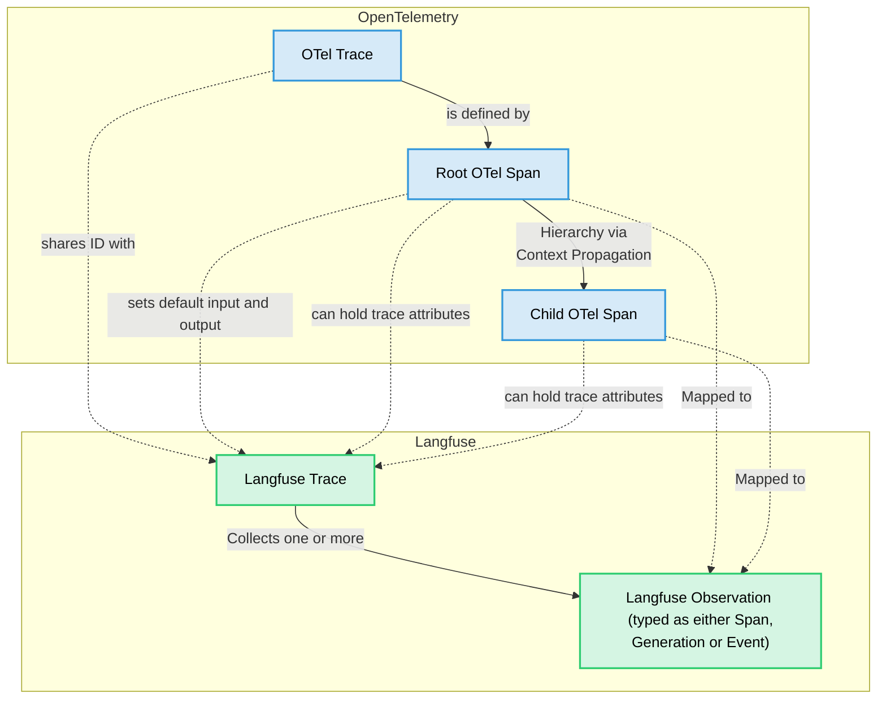

# Langfuse SDK

Langfuse 提供 Python 和 JavaScript/TypeScript SDK，既可以追踪模型、Agent 与工具调用，也可以管理 Prompt、Dataset、Score 和实验。

## 快速开始

使用项目的 Public Key、Secret Key 与服务地址初始化 SDK。短生命周期应用必须正确 Flush 或关闭 OpenTelemetry，以免进程退出前尚有批次未导出。

## 安装与设置

Python 安装 `langfuse`，使用 `get_client()` 获取环境配置的客户端；JS/TS 的追踪分离为 `@langfuse/tracing` 和 `@langfuse/otel`，非追踪操作使用 `@langfuse/client`。

```bash
# Python
pip install langfuse
# JavaScript / TypeScript
npm install @langfuse/tracing @langfuse/otel @langfuse/client @opentelemetry/sdk-node
```

环境变量：

```bash
LANGFUSE_PUBLIC_KEY="pk-lf-..."
LANGFUSE_SECRET_KEY="sk-lf-..."
LANGFUSE_BASE_URL="https://cloud.langfuse.com"
```

Cloud 地域不同需要使用相应地址；自托管则指定实例地址。

### OpenTelemetry 初始化

JS/TS 需要在业务埋点前初始化 OTEL Processor。Python 的 SDK 通常自动管理相关初始化。执行后可以在 Langfuse UI 查看 Trace。

## OpenTelemetry 基础

Langfuse SDK 基于 OpenTelemetry。已有 OTEL Instrumentation 的项目可以利用相同上下文传播机制；Span 导出控制、Sampling、Masking 等行为应统一设计。

## 浏览器与前端应用

浏览器直接携带 Project Secret Key 会泄露凭据。应通过后端或受控 API 接收浏览器事件，并在可信环境执行 Langfuse API 调用。

## 其他语言

可以通过原生 OpenTelemetry SDK、OTLP 端点传输 Trace；Prompt 管理、评分和数据查询则可使用公开 REST API。进一步阅读[手动埋点](/official/observability/sdk/instrumentation)及[API 文档](/official/api-and-data-platform/features/public-api)。

## 官方技术示例（保留原始可执行语法）

以下是源文档中的全部代码块与配置示例，代码保持原文，不自动翻译变量名，以免破坏运行行为。

### 示例 1

```bash
npm install @langfuse/tracing @langfuse/otel @opentelemetry/sdk-node
```

### 示例 2

```ts
import { NodeSDK } from "@opentelemetry/sdk-node";
import { LangfuseSpanProcessor } from "@langfuse/otel";

export const sdk = new NodeSDK({
  spanProcessors: [new LangfuseSpanProcessor()],
});

sdk.start();
```

### 示例 3

```ts
import { sdk } from "./instrumentation";
import { startActiveObservation } from "@langfuse/tracing";

async function main() {
  await startActiveObservation("my-first-trace", async (span) => {
    span.update({
      input: "Hello, Langfuse!",
      output: "This is my first trace!",
    });
  });
}

// Shutdown flushes events and is required for short-lived applications
main().finally(() => sdk.shutdown());
```

### 示例 4

```bash
npx tsx index.ts
```

### 示例 5

```bash
pip install langfuse
```

### 示例 6

```bash
npm install @langfuse/tracing @langfuse/otel @opentelemetry/sdk-node
```

### 示例 7

```ts
import { NodeSDK } from "@opentelemetry/sdk-node";
import { LangfuseSpanProcessor } from "@langfuse/otel";

const sdk = new NodeSDK({
  spanProcessors: [new LangfuseSpanProcessor()],
});

sdk.start();
```

### 示例 8

```python
from langfuse import get_client

langfuse = get_client()

# Verify connection
if langfuse.auth_check():
    print("Langfuse client is authenticated and ready!")
else:
    print("Authentication failed. Please check your credentials and host.")
```

### 示例 9

```python
from langfuse import Langfuse

langfuse = Langfuse(
  public_key="your-public-key",
  secret_key="your-secret-key",
  base_url="https://cloud.langfuse.com", # 🇪🇺 EU region
  # Other Langfuse data regions include 🇺🇸 US: https://us.cloud.langfuse.com, 🇯🇵 Japan: https://jp.cloud.langfuse.com and ⚕️ HIPAA: https://hipaa.cloud.langfuse.com
)
```

### 示例 10

```ts
import { LangfuseClient } from "@langfuse/client";

const langfuse = new LangfuseClient();
```

### 示例 11

```ts
import { LangfuseClient } from "@langfuse/client";

const langfuse = new LangfuseClient({
  publicKey: "your-public-key",
  secretKey: "your-secret-key",
  baseUrl: "https://cloud.langfuse.com", // or your self-hosted instance
});
```

### 示例 12




::: info 翻译状态
本页已完成主要章节的中文整理，并保存官方代码块；源文档的复杂表格、FAQ 和部分细节尚需逐段精校，因此当前标记为**待完善译稿**，不应视为完整质量验收。
:::

原文：[Langfuse SDK 概览](https://langfuse.com/docs/observability/sdk/overview)。
