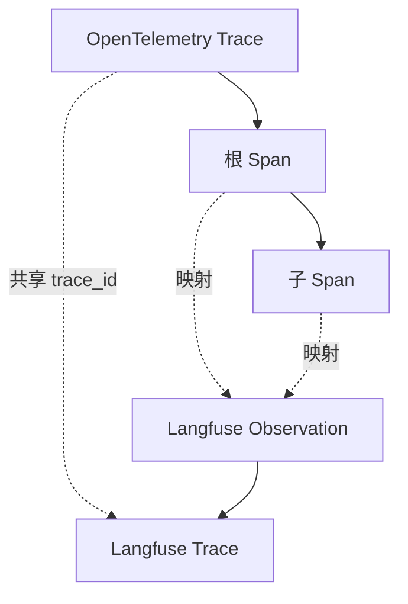

# Langfuse SDK

Langfuse 提供两个官方 SDK：

- **[Python SDK v4](https://github.com/langfuse/langfuse-python)**：[PyPI](https://pypi.org/project/langfuse/)
- **[JavaScript / TypeScript SDK v5](https://github.com/langfuse/langfuse-js)**：[npm](https://www.npmjs.com/package/@langfuse/tracing)
- 其他语言可通过 [OpenTelemetry](https://langfuse.com/integrations/native/opentelemetry) 集成。

从旧主版本升级时，参阅 [Python v3 → v4](/official/observability/sdk/upgrade-path/python-v3-to-v4) 或 [JS/TS v4 → v5](/official/observability/sdk/upgrade-path/js-v4-to-v5)。

Langfuse SDK 是创建[自定义 Trace 与 Observation](/official/observability/sdk/instrumentation)、使用[提示词管理](/official/prompt-management/overview)及[评估](/official/evaluation/overview)功能的推荐方式。Cloud 与自托管使用相同的接入代码，区别仅在认证凭据与 Base URL。

::: info
未使用 Langfuse SDK 时，可使用 OpenTelemetry SDK、Collector 或自动埋点库直接发送 Span。官方公告：Langfuse Cloud 的 `POST /api/public/ingestion` 自 **2026 年 11 月 16 日**起只接受 Score，不再接受其他摄入数据。自定义集成应迁移至 [OpenTelemetry / v4](https://langfuse.com/integrations/native/opentelemetry/migration-to-v4)。
:::

**主要优势：**基于 OpenTelemetry、异步导出以降低业务延迟、支持第三方框架、使用同步时间戳准确测量延迟、提供可供后续使用的 ID、自动管理 Observation 嵌套，以及捕获并记录 SDK 错误以避免影响主应用。

本页着重介绍 SDK 追踪能力。Prompt 与 Evaluation 的 SDK 用法在对应模块单独说明。

自托管环境应先检查[SDK/Server 兼容性矩阵](https://langfuse.com/docs/compatibility#sdk-server)。旧版 SDK 文档快照：[Python v3](https://python-sdk-v3.docs-snapshot.langfuse.com/docs/observability/sdk/overview/)和 [JS/TS v4](https://js-sdk-v4-docs-snapshot.langfuse.com/docs/observability/sdk/overview/)。

## 快速开始

### Python SDK

安装并配置凭据后，可通过 Context Manager 或 `@observe()` 记录调用。完整的官方 Python 入门示例已迁入[Tracing 快速开始](/official/observability/get-started)。

### JavaScript / TypeScript SDK

**1. 安装依赖**

```bash
npm install @langfuse/tracing @langfuse/otel @opentelemetry/sdk-node
```

**2. 配置环境变量**

```bash
LANGFUSE_PUBLIC_KEY="pk-lf-..."
LANGFUSE_SECRET_KEY="sk-lf-..."
LANGFUSE_BASE_URL="https://cloud.langfuse.com"
```

**3. 在 `instrumentation.ts` 初始化 OpenTelemetry**

```ts
import { NodeSDK } from "@opentelemetry/sdk-node";
import { LangfuseSpanProcessor } from "@langfuse/otel";

export const sdk = new NodeSDK({
  spanProcessors: [new LangfuseSpanProcessor()],
});

sdk.start();
```

应用入口（例如 `index.ts`）应先导入这个文件。

**4. 在 `index.ts` 追踪应用**

可通过 Context Manager、包装函数或手动创建 Observation。以下使用 `startActiveObservation()`：

```ts
import { sdk } from "./instrumentation";
import { startActiveObservation } from "@langfuse/tracing";

async function main() {
  await startActiveObservation("my-first-trace", async (span) => {
    span.update({
      input: "Hello, Langfuse!",
      output: "This is my first trace!",
    });
  });
}

// Shutdown flushes events and is required for short-lived applications
main().finally(() => sdk.shutdown());
```

**5. 执行脚本**

```bash
npx tsx index.ts
```


[查看官方演示 Trace](https://cloud.langfuse.com/project/cloramnkj0002jz088vzn1ja4/traces/ef10df7b3f9e4a8adc834c18934bace0?timestamp=2025-12-03T14%3A44%3A10.907Z&observation=c71b480595bbe18c)。

## 安装和设置

### 安装 SDK

**Python：**

```bash
pip install langfuse
```

**JS/TS：**

```bash
npm install @langfuse/tracing @langfuse/otel @opentelemetry/sdk-node
```

JS/TS SDK 采用模块化设计：

- `@langfuse/tracing`：创建 Observation、属性传播与 Trace 上下文管理。
- `@langfuse/otel`：将 OpenTelemetry Span 发送到 Langfuse。
- `@langfuse/client`：Prompt、Score、Dataset 和查询等非追踪操作。
- `@opentelemetry/sdk-node`：Node.js 侧 OpenTelemetry 初始化。

### 配置凭据

从 [Langfuse Cloud](https://langfuse.com/cloud)或自托管项目的 Settings → API Keys 中获取项目级密钥。可以使用环境变量，也可以通过 Client 构造参数传入。

| 部署区域 | Base URL |
| --- | --- |
| EU（默认） | `https://cloud.langfuse.com` |
| US | `https://us.cloud.langfuse.com` |
| Japan | `https://jp.cloud.langfuse.com` |
| HIPAA | `https://hipaa.cloud.langfuse.com` |
| 自托管 | 自己的实例 URL |

### 初始化 OpenTelemetry（JS/TS）

Python SDK 初始化 Client 时会自动设置 OpenTelemetry，默认导出 Langfuse 与 GenAI/LLM Span。可以使用 `should_export_span` 修改过滤策略；旧参数 `blocked_instrumentation_scopes` 尚可用，但已弃用。

JS/TS 使用 `LangfuseSpanProcessor` 在 NodeSDK 中注册：

```ts
import { NodeSDK } from "@opentelemetry/sdk-node";
import { LangfuseSpanProcessor } from "@langfuse/otel";

const sdk = new NodeSDK({
  spanProcessors: [new LangfuseSpanProcessor()],
});

sdk.start();
```

默认也仅导出 Langfuse 和 GenAI/LLM Span；自定义可设置 `shouldExportSpan`。更多过滤、Masking 等配置见[高级功能](/official/observability/sdk/advanced-features)。

**Next.js 注意事项：**`@vercel/otel` v2 及以上版本支持通过 `registerOTel` 注册 `LangfuseSpanProcessor`。旧版本不支持这些包依赖的 OpenTelemetry JS SDK v2。使用上面标准 `NodeSDK` 的方式不受此版本约束。参阅[官方 Next.js / Vercel AI SDK 示例](https://langfuse.com/docs/observability/sdk/typescript/instrumentation#native-instrumentation)。

### 初始化 Client

**Python：**调用 `get_client()` 会按环境变量初始化并复用实例：

```python
from langfuse import get_client

langfuse = get_client()

# Verify connection
if langfuse.auth_check():
    print("Langfuse client is authenticated and ready!")
else:
    print("Authentication failed. Please check your credentials and host.")
```

也可以直接传入参数：

```python
from langfuse import Langfuse

langfuse = Langfuse(
  public_key="your-public-key",
  secret_key="your-secret-key",
  base_url="https://cloud.langfuse.com", # 🇪🇺 EU region
  # Other Langfuse data regions include 🇺🇸 US: https://us.cloud.langfuse.com, 🇯🇵 Japan: https://jp.cloud.langfuse.com and ⚕️ HIPAA: https://hipaa.cloud.langfuse.com
)
```

如果使用相同的 Public Key 创建多个 Langfuse 实例，会复用已有单例，后传入的不同参数可能被忽略。[Python 完整构造参数](https://python.reference.langfuse.com/langfuse#Langfuse)。

**JS/TS：**通过 `LangfuseClient` 管理非追踪功能：

```ts
import { LangfuseClient } from "@langfuse/client";

const langfuse = new LangfuseClient();
```

也可显式传入密钥和 URL：

```ts
import { LangfuseClient } from "@langfuse/client";

const langfuse = new LangfuseClient({
  publicKey: "your-public-key",
  secretKey: "your-secret-key",
  baseUrl: "https://cloud.langfuse.com", // or your self-hosted instance
});
```

配置完成后，可继续[对应用埋点](/official/observability/sdk/instrumentation)、[管理提示词](/official/prompt-management/get-started)、[运行实验](/official/evaluation/experiments/experiments-via-sdk)和[查询数据](/official/api-and-data-platform/features/query-via-sdk)。

## OpenTelemetry 基础

Langfuse SDK 构建在 [OpenTelemetry](https://opentelemetry.io/) 之上，提供通用规范、跨异步任务的 Context Propagation、Observation 属性传播，以及与第三方 Instrumentation 的兼容性。



- **OTel Trace**：请求或事务跨服务的完整生命周期，由首个根 Span 定义；自身没有独立的起止时间。
- **OTel Span**：具有起止时间、名称和属性的一次工作单元，通过 Parent/Child 关系构成层级。
- **Langfuse Trace**：共享 `trace_id` 的 Observation 集合，具有 User ID、Session ID 等公共关联属性，ID 与 OTEL Trace 相同。整体 Input/Output 应在根 Observation 上设置；v4 的 Trace 级 Input/Output 已弃用。
- **Langfuse Observation**：OTEL Span 的 Langfuse 表示，可以是 `span`、`generation`、`event` 或 [其他类型](/official/observability/features/observation-types)。
- **Langfuse Span**：非 LLM 操作的通用 Observation。
- **Langfuse Generation**：LLM 调用专用类型，包含 Model、Model Parameters、Usage Details 和 Cost Details。
- **Langfuse Event**：时间点事件。

OpenTelemetry 自动在被追踪函数、第三方 Instrumentation 或手动创建的子 Span 之间传播当前 Trace Context。Langfuse 提供 `LangfuseSpan` 和 `LangfuseGeneration` 等便捷封装，可为 Span 设置评分、媒体内容等数据。

使用 Python `propagate_attributes()` 或 JS/TS `propagateAttributes()`，可以向子 Observation 传播 User ID、Session ID、Metadata、Version 和 Tag；Python 还支持请求级 Environment。新版应优先使用属性传播，而不是旧 Trace 属性修改 API。

## 相关指南

- [应用埋点](/official/observability/sdk/instrumentation)
- [高级配置](/official/observability/sdk/advanced-features)
- [升级路径](/official/observability/sdk/upgrade-path/index)
- [SDK 排障与 FAQ](/official/observability/sdk/troubleshooting-and-faq)
- [Python API Reference](https://python.reference.langfuse.com/)
- [JS/TS API Reference](https://js.reference.langfuse.com/)

## 浏览器和前端应用

追踪 SDK 需要 Secret Key，因此**只适用于服务端环境**，绝不能把 Secret Key 打包到浏览器或移动应用中。应在调用 LLM Provider 的后端执行追踪，并将 Trace ID 返回前端以便关联反馈。

前端可使用 [`@langfuse/browser`](/official/evaluation/evaluation-methods/scores-via-sdk#browser-score-ingestion)添加用户反馈和客户端评分：它只使用 Public Key，并直接向摄入 API 发送 Score，**不会创建 Trace 或 Observation**。

如果浏览器需要调用 LLM，应该通过受控后端或代理调用，并在服务端追踪。

## 其他语言

Python 与 JavaScript/TypeScript 之外，可以使用相应语言的 OpenTelemetry SDK，把 Span 发送到 [Langfuse OTLP Endpoint](https://langfuse.com/integrations/native/opentelemetry)。

可选实现：

- [JetBrains Tracy（Kotlin/Java）](https://github.com/JetBrains/tracy)
- [OpenTelemetry Java](https://opentelemetry.io/docs/languages/java/)
- [OpenTelemetry .NET](https://opentelemetry.io/docs/languages/net/)
- [OpenTelemetry Go](https://opentelemetry.io/docs/languages/go/)
- [OpenTelemetry C++](https://opentelemetry.io/docs/languages/cpp/)
- [OpenTelemetry Erlang/Elixir](https://opentelemetry.io/docs/languages/erlang/)
- [OpenTelemetry Ruby](https://opentelemetry.io/docs/languages/ruby/)
- [OpenTelemetry PHP](https://opentelemetry.io/docs/languages/php/)
- [OpenTelemetry Rust](https://opentelemetry.io/docs/languages/rust/)
- [OpenTelemetry Swift](https://opentelemetry.io/docs/languages/swift/)

提示词管理、评估和数据查询可以通过[公共 API](/official/api-and-data-platform/features/public-api)集成到任意运行时。另有[社区维护 SDK 清单](https://github.com/langfuse/langfuse-examples?tab=readme-ov-file#community-maintained-sdks)。

---

原文：[SDK Overview](https://langfuse.com/docs/observability/sdk/overview) · 中文正文、核心操作步骤及所有独立代码块已补充，原文重复的共享组件通过本站已译文链接复用。
