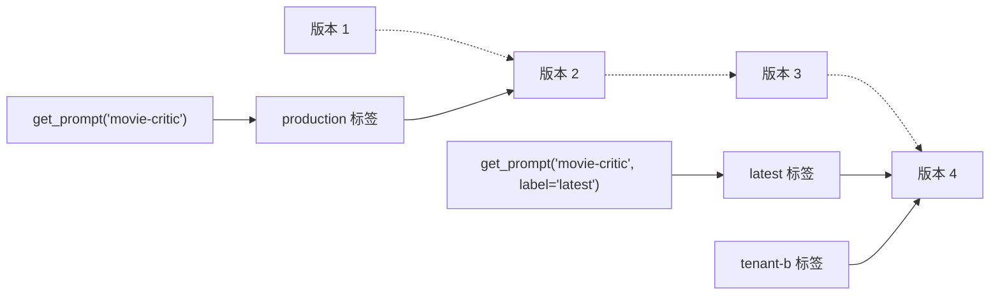

# 提示词管理核心概念

本页介绍提示词管理的概念与最佳实践。若还不清楚其价值，可以先阅读[概览](/official/prompt-management/overview)；准备动手时，参阅[快速开始](/official/prompt-management/get-started)。

## Prompt 对象

Langfuse 的提示词对象包含给 LLM 的指令（一个字符串或消息数组），以及可选的[附加配置](https://langfuse.com/docs/prompt-management/features/config)，用于影响模型行为。对象还包含用于管理版本、变体与部署的属性。完整字段和方法见[SDK 参考](https://langfuse-js-git-main-langfuse.vercel.app/interfaces/_langfuse_core.Prompt.Chat.html)。

### Text 与 Chat 提示词

Langfuse 支持两种类型。创建时指定的 `type` **以后不能更改**。

**Text Prompt** 是单个字符串，适合简单场景或仅需系统消息的应用：

```json
{
  "name": "movie-critic",
  "type": "text",
  "prompt": "As a movie critic, do you like Dune 2?",
  "version": 1
}
```

**Chat Prompt** 是带角色的消息数组，适合管理完整对话结构、示例交流或聊天历史：

```json
{
  "name": "movie-critic-chat",
  "type": "chat",
  "prompt": [
    { "role": "system", "content": "You are a movie critic." },
    { "role": "user", "content": "Do you like Dune 2?" }
  ],
  "version": 1
}
```

::: info
多数应用最初可以使用 Text Prompt。当应用需要管理多条消息、角色结构或对话历史时，更适合使用 Chat Prompt，使整个消息结构都由提示词管理系统维护。
:::

### 动态渲染提示词

提示词支持三种运行时动态内容：

| 类型 | 典型用途 |
| --- | --- |
| [变量](/official/prompt-management/features/variables) | 在消息中插入动态文本 |
| [提示词引用](/official/prompt-management/features/composability) | 复用其他提示词，避免重复维护通用指令 |
| [消息占位符](/official/prompt-management/features/message-placeholders) | 插入消息数组，例如聊天历史 |

## 提示词缓存

Langfuse Prompt Management 使用缓存主要是为了：

1. **避免为应用增加调用延迟**；
2. **降低服务不可用带来的风险**。

缓存意味着提示词更新后，最先产生的几条 Trace 可能仍在使用旧版本。如果业务需要立即生效，可缩短缓存 TTL（存活时间），或者禁用缓存。

详见[缓存说明](https://langfuse.com/docs/prompt-management/features/caching)。

## 版本与标签

在生产环境中，需要区分两个互补的概念。

**Version（版本）**：不可变的历史记录，每次修改产生新版本，例如 1、2、3。

**Label（标签）**：指向特定版本的可移动引用。应用代码一般通过标签而不是固定版本获取提示词。

常见标签：

- `production`：默认标签，供生产应用使用；
- `latest`：总是指向最新版本；
- 自定义标签：用于预发布、测试、租户划分或 A/B 测试。

更多说明见[版本控制与标签](https://langfuse.com/docs/prompt-management/features/prompt-version-control)。



### 部署工作流

1. **创建与测试**：创建新版本，自动获得 `latest` 标签。
2. **验证**：在开发环境或 Playground 中测试新版本。
3. **发布**：将 `production` 标签指向新版本。
4. **监控**：生产应用下一次获取提示词时会拿到新版本（受缓存策略影响）。
5. **回滚**：必要时将 `production` 标签重新指向旧版本。

由于代码引用的是标签，因此整个过程无需修改应用代码。

---

原文：[Prompt Management Concepts](https://langfuse.com/docs/prompt-management/data-model) · 非官方中文翻译。
