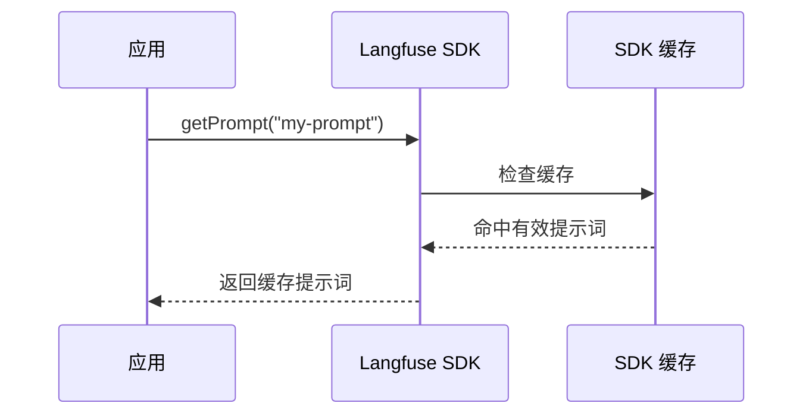
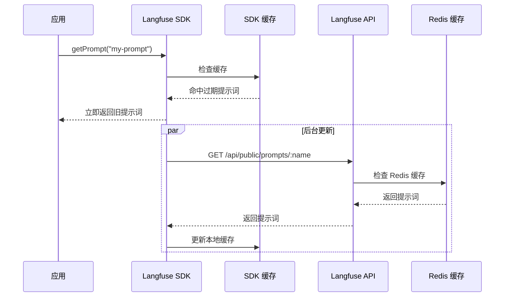
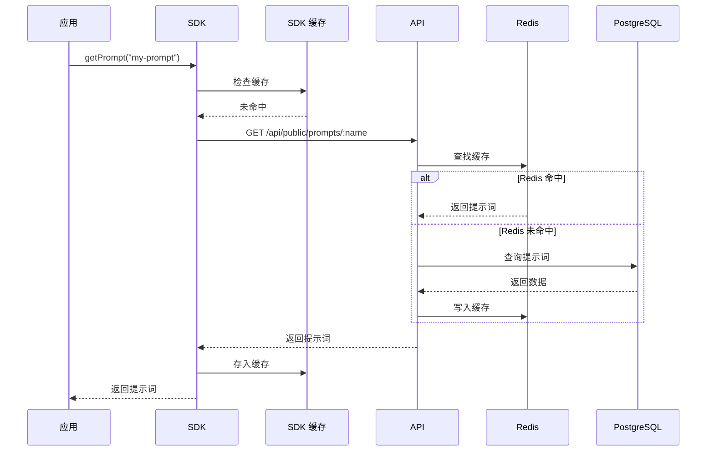
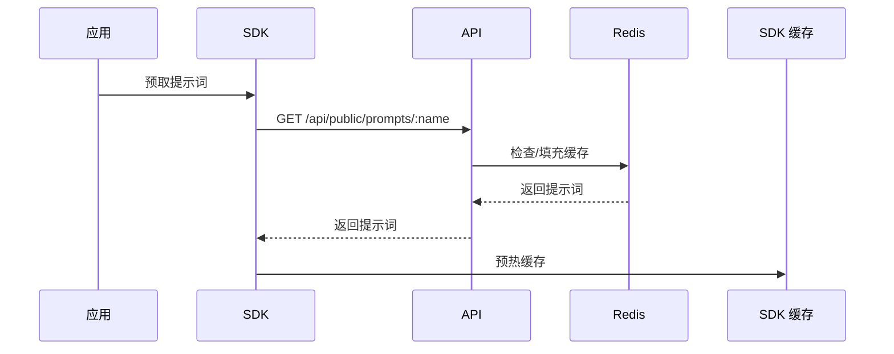
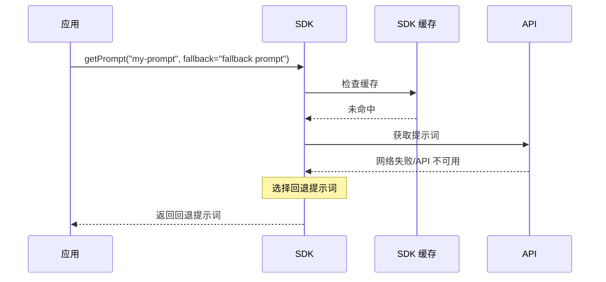

# SDK 中的提示词缓存

Langfuse SDK 会在客户端缓存提示词，**首次获取后无需额外网络等待**，还能降低服务故障风险。也可在启动时预取提示词或提供回退提示词。

## 缓存命中

本地缓存中存在未过期的提示词时，SDK **立即返回**，不会发送网络请求。



## 后台重新验证

TTL 过期后，SDK **立即返回过期缓存**，同时在后台重新获取并更新提示词；用户请求无需等待网络。



## 缓存未命中

在应用首次启动等本地无缓存的情况下，SDK 从 API 获取提示词。API 自身也使用 Redis 缓存来缩短响应时间：



多层回退可提高韧性：Redis 不可用时，数据库仍可提供数据。

## 可选：启动时预取

应用启动时预先获取提示词，能在开始处理业务请求前填充缓存。通常不是必需的，因为首次获取的小幅延迟往往可以接受。



## 可选：回退提示词

本地缓存为空，Langfuse API 又无法访问时，SDK 可使用预先提供的 `fallback`。



一般不需要专门实现，因为 Prompt API 可用性较高，且 SDK 缓存通常足以应付短暂故障。[服务状态页](https://status.langfuse.com)。

## 可选：调整缓存时间（TTL）

默认 TTL 是 **60 秒**。过期后 SDK 异步在后台重新获取，不阻塞业务请求。

Python：

```python
# 获取 production 版本并缓存 5 分钟
prompt = langfuse.get_prompt("movie-critic", cache_ttl_seconds=300)
```

TypeScript：

```typescript
import { LangfuseClient } from "@langfuse/client";
const langfuse = new LangfuseClient();
const prompt = await langfuse.prompt.get("movie-critic", {
  cacheTtlSeconds: 300,
});
```

## 可选：禁用缓存

将 `cache_ttl_seconds` / `cacheTtlSeconds` 设为 `0`，每次调用都从 API 获取最新提示词。适合希望立即看到改动的非生产环境。

```python
prompt = langfuse.get_prompt("movie-critic", cache_ttl_seconds=0)
prompt = langfuse.get_prompt("movie-critic", cache_ttl_seconds=0, label="latest")
```

```typescript
const prompt = await langfuse.prompt.get("movie-critic", {
  cacheTtlSeconds: 0,
});
const latest = await langfuse.prompt.get("movie-critic", {
  cacheTtlSeconds: 0,
  label: "latest",
});
```

## 可选：保证可用性

可在启动时预取并同时提供回退提示词，详见[高可用指南](/official/prompt-management/features/guaranteed-availability)。

## 首次获取的性能测量

官方在完全关闭缓存后执行以下代码：

```python
prompt = langfuse.get_prompt("perf-test", cache_ttl_seconds=0)
prompt.compile(input="test")
```

在 Langfuse Cloud 上连续执行 1000 次（包含网络延迟）的结果：


```text
count    1000.000000
mean        0.039335 sec
std         0.014172 sec
min         0.032702 sec
25%         0.035387 sec
50%         0.037030 sec
75%         0.041111 sec
99%         0.068914 sec
max         0.409609 sec
```

可通过[性能基准 Notebook](https://langfuse.com/resources/engineering/prompt-management-performance-benchmark)自行验证。这些数字是原文测试结果，不保证当前网络下相同。

---

原文：[Prompt Caching](https://langfuse.com/docs/prompt-management/features/caching) · 非官方中文翻译。
