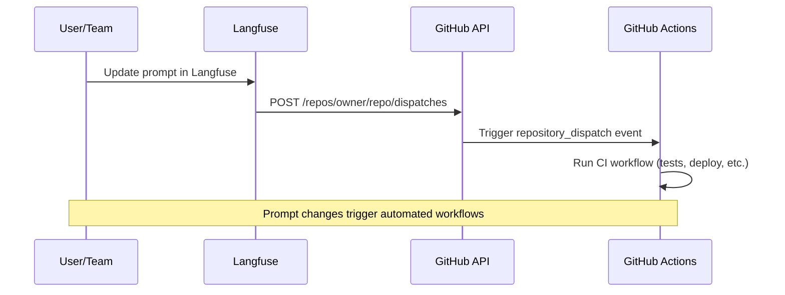
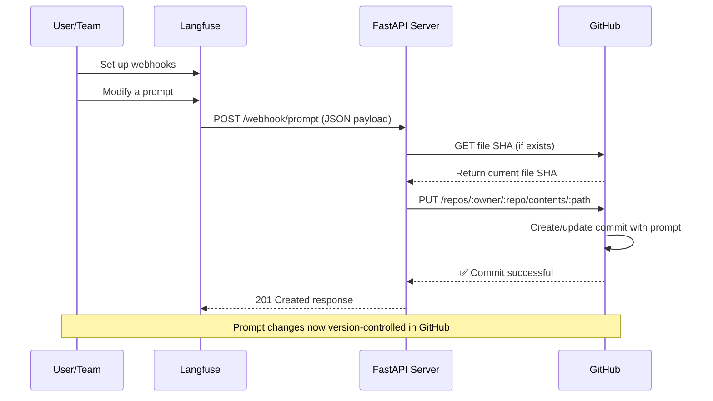

# Langfuse 提示词与 GitHub 集成

## 概述

GitHub 集成提供两条路径：一是使用 Repository Dispatch，在提示词发生变化时执行 GitHub Actions；二是用接收 Webhook 的服务器把 Langfuse 提示词同步为仓库文件。前者不需要额外基础设施；后者需要部署接收端。

## 触发 GitHub Actions

通过 `repository_dispatch` 在提示词变更时启动 CI/CD。工作流图如下：



## 创建工作流

将以下工作流保存为 `.github/workflows/langfuse-ci.yml`。测试 Job 先运行，只有带 `production` 标签的提示词才进入部署 Job：
```yaml
name: Langfuse Prompt CI
on:
  repository_dispatch:
    types: [langfuse-prompt-update]
  workflow_dispatch:

jobs:
  test:
    runs-on: ubuntu-latest
    steps:
      - uses: actions/checkout@v4
      - name: Run tests
        run: |
          echo "Testing prompt: ${{ github.event.client_payload.prompt.name }} v${{ github.event.client_payload.prompt.version }}"
          # Add your test commands
          # npm test
          # python -m pytest

  deploy:
    needs: test
    runs-on: ubuntu-latest
    if: contains(github.event.client_payload.prompt.labels, 'production')
    steps:
      - uses: actions/checkout@v4
      - name: Deploy to production
        run: |
          echo "Deploying ${{ github.event.client_payload.prompt.name }} v${{ github.event.client_payload.prompt.version }}"
          # Your deployment commands
```
使用 `github.event.client_payload.*` 获取事件信息：
```yaml
# Example: Access webhook data in your workflow
- name: Process prompt data
  run: |
    echo "Action: ${{ github.event.client_payload.action }}"
    echo "Prompt: ${{ github.event.client_payload.prompt.name }}"
    echo "Version: ${{ github.event.client_payload.prompt.version }}"
    echo "Labels: ${{ github.event.client_payload.prompt.labels }}"

- name: Deploy only production prompts
  if: contains(github.event.client_payload.prompt.labels, 'production')
  run: echo "Deploying production prompt"
```


## 创建令牌

在 GitHub Settings → Developer settings → Personal access tokens 新建 Classic 或 Fine-grained Token。原文列出 Classic 的 `repo` / `public_repo` Scope，以及 Fine-grained PAT 或 GitHub App 的 Actions 读写权限。应按 GitHub 当前要求核对并采用最小权限。

## 配置 Langfuse 自动化

进入 Prompts → Automations，点击 Create Automation，选择 GitHub Repository Dispatch。Dispatch URL 设为 `https://api.github.com/repos/{owner}/{repo}/dispatches`；Event Type 为 `langfuse-prompt-update`，必须与 Workflow 对应；输入 GitHub Token 并保存。修改带 production 标签的 Prompt 后在 GitHub Actions 验证测试与部署 Job。

## 同步提示词到仓库

同步是**单向的**：Langfuse 在创建提示词版本或修改标签时发送 `repository_dispatch` 或 Webhook；Langfuse 不会主动读取 GitHub。要从 GitHub PR 反向同步，需要 CI 调用 `POST /api/public/v2/prompts`。流程：



## 前提条件

需要 Langfuse 项目及 Prompt Owner 权限、GitHub 仓库、具有最小访问权限的 PAT、Python 3.9+ 的 FastAPI/Uvicorn/httpx/Pydantic，以及公开可访问的 HTTPS Webhook URL。

## 配置 Langfuse Webhook

进入 Prompts → Webhooks，点击 Create Webhook；可以筛选 created、updated、deleted 事件（默认全部）；填入 `https://<your-domain>/webhook/prompt`；保存后复制 Signing Secret。响应应为 2xx，失败事件将按指数退避重试。示例 Payload：
```json
{
  "id": "550e8400-e29b-41d4-a716-446655440000",
  "timestamp": "2024-07-10T10:30:00Z",
  "type": "prompt-version",
  "action": "created",
  "prompt": {
    "id": "prompt_abc123",
    "name": "movie-critic",
    "version": 3,
    "projectId": "xyz789",
    "labels": ["production", "latest"],
    "prompt": "As a {{criticLevel}} movie critic, rate {{movie}} out of 10.",
    "type": "text",
    "config": { "...": "..." },
    "commitMessage": "Improved critic persona",
    "tags": ["entertainment"],
    "createdAt": "2024-07-10T10:30:00Z",
    "updatedAt": "2024-07-10T10:30:00Z"
  }
}
```


## GitHub 环境配置

在 `.env` 中配置如下变量。默认提交到 `main` 分支的 `langfuse_prompt.json`，配置 `REQUIRED_LABEL` 后只同步有对应标签的 Prompt。同步所需 Fine-grained PAT 权限是 Contents 读写与 Metadata 只读；Classic PAT 原文列出 public_repo 或 repo Scope。
```bash
GITHUB_TOKEN=<your_github_pat_here>
GITHUB_REPO_OWNER=<github_username_or_org>
GITHUB_REPO_NAME=<repo_name>
# (Optional) GITHUB_FILE_PATH=langfuse_prompt.json
# (Optional) GITHUB_BRANCH=main
# (Optional) REQUIRED_LABEL=production
```


## FastAPI Webhook 服务器

将完整示例存为 `main.py`。服务读取现有文件 SHA，调用 GitHub Contents API 提交 JSON，并生成版本变更提交信息。
```python
from typing import Any, Dict
from uuid import UUID
import json
import base64

import httpx
from pydantic import BaseModel, Field
from pydantic_settings import BaseSettings, SettingsConfigDict
from fastapi import FastAPI, HTTPException, Body

class GitHubSettings(BaseSettings):
    """GitHub repository configuration."""
    GITHUB_TOKEN: str
    GITHUB_REPO_OWNER: str
    GITHUB_REPO_NAME: str
    GITHUB_FILE_PATH: str = "langfuse_prompt.json"
    GITHUB_BRANCH: str = "main"
    REQUIRED_LABEL: str = ""  # Optional: only sync prompts with this label

    model_config = SettingsConfigDict(
        env_file=".env",
        env_file_encoding="utf-8",
        case_sensitive=True
    )

config = GitHubSettings()

class LangfuseEvent(BaseModel):
    """Langfuse webhook event structure."""
    id: UUID = Field(description="Event identifier")
    timestamp: str = Field(description="Event timestamp")
    type: str = Field(description="Event type")
    action: str = Field(description="Performed action")
    prompt: Dict[str, Any] = Field(description="Prompt content")

async def sync(event: LangfuseEvent) -> Dict[str, Any]:
    """Synchronize prompt data to GitHub repository."""
    # Check if prompt has required label (if specified)
    if config.REQUIRED_LABEL:
        prompt_labels = event.prompt.get("labels", [])
        if config.REQUIRED_LABEL not in prompt_labels:
            return {"skipped": f"Prompt does not have required label '{config.REQUIRED_LABEL}'"}

    api_endpoint = f"https://api.github.com/repos/{config.GITHUB_REPO_OWNER}/{config.GITHUB_REPO_NAME}/contents/{config.GITHUB_FILE_PATH}"

    request_headers = {
        "Authorization": f"Bearer {config.GITHUB_TOKEN}",
        "Accept": "application/vnd.github.v3+json"
    }

    content_json = json.dumps(event.prompt, indent=2)
    encoded_content = base64.b64encode(content_json.encode("utf-8")).decode("utf-8")

    name = event.prompt.get("name", "unnamed")
    version = event.prompt.get("version", "unknown")
    message = f"{event.action}: {name} v{version}"

    payload = {
        "message": message,
        "content": encoded_content,
        "branch": config.GITHUB_BRANCH
    }

    async with httpx.AsyncClient() as http_client:
        try:
            existing = await http_client.get(api_endpoint, headers=request_headers, params={"ref": config.GITHUB_BRANCH})
            if existing.status_code == 200:
                payload["sha"] = existing.json().get("sha")
        except Exception:
            pass

        try:
            response = await http_client.put(api_endpoint, headers=request_headers, json=payload)
            response.raise_for_status()
            return response.json()
        except Exception as e:
            raise HTTPException(status_code=500, detail=f"Repository sync failed: {str(e)}")

app = FastAPI(title="Langfuse GitHub Sync", version="1.0")

@app.post("/webhook/prompt", status_code=201)
async def receive_webhook(event: LangfuseEvent = Body(...)):
    """Process Langfuse webhook and sync to GitHub."""
    result = await sync(event)
    return {
        "status": "synced",
        "commit_info": result.get("commit", {}),
        "file_info": result.get("content", {})
    }

@app.get("/status")
async def health_status():
    """Service health check."""
    return {"healthy": True}
```


## 安装和运行

安装所需依赖：
```bash
pip install fastapi uvicorn pydantic-settings httpx
```
启动 Uvicorn：
```bash
uvicorn main:app --reload --port 8000
```
**注意**：源码定义的健康检查路由为 `/status`，不是文字中写的 `/health`。本地可测试 `http://localhost:8000/status`。

## 部署与测试

将服务部署到 Render、Fly.io 或 Heroku 等 HTTPS 平台，配置环境变量。在 Langfuse 中将 Webhook URL 改为部署地址；更新 Prompt 后验证 GitHub 仓库出现新提交。

## 安全注意

生产环境务必使用签名密钥和 `x-langfuse-signature` 校验原始请求体（参阅[HMAC 示例](/official/prompt-management/features/webhooks-slack-integrations)）；仅给 PAT 必需的仓库权限，并处理重试、事件去重和并发冲突。**官方 FastAPI 示例只验证 Payload 结构，没有实现 HMAC 验签；不要在未加固时公开使用。**

---

原文：[GitHub Integration](https://langfuse.com/docs/prompt-management/features/github-integration) · 非官方中文翻译；完整保留所有官方代码与示例。
